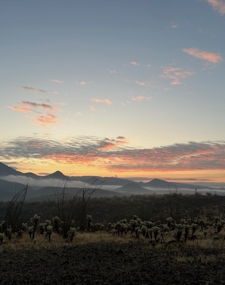
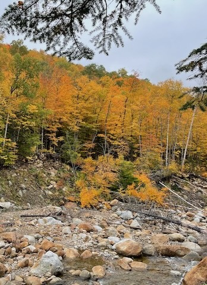
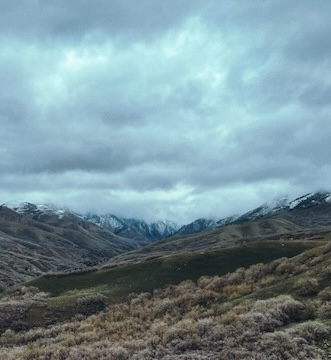
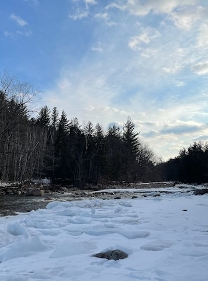
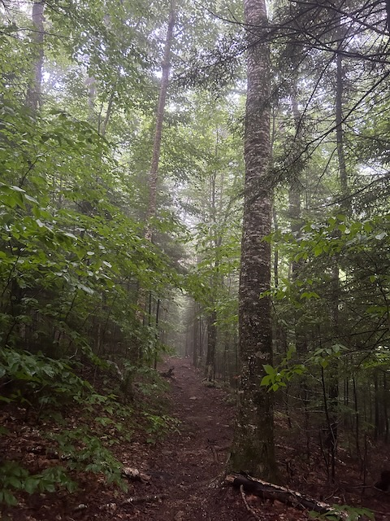
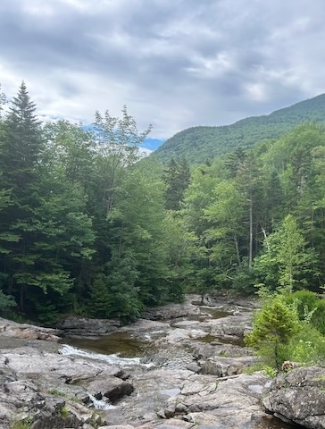
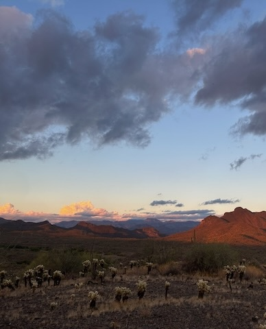
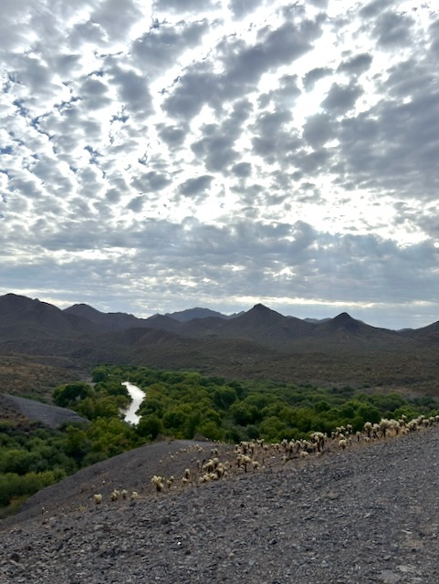
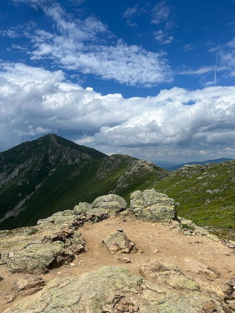

## Background

In 2021, sick of living in a half-closed city and working from my bedroom everyday, I stumbled upon the backpacking hobby.
It looked like the perfect escape.
I became immediately obsessed and convinced myself to buy the necessary equipment and prepare for a trip that fall with my roommate and his dog.
In October, we went to the [White Mountains](https://www.fs.usda.gov/whitemountain) and followed the [Isolation Loop](https://sectionhiker.com/backpacking-white-mountain-4000-footers-guidebook/backpacking-a-mt-isolation-loop/) trail.
It was difficult, but I had a great time.
I specifically recall leaving on the third day with a feeling of incredible mental clarity – the noise and background hum that had me feeling "congested" had finally been cleared.
I was hooked.

Since then, I have gone on a few more trips to the White Mountains and done some simple camping at the local [Wompatuck State Park](https://www.mass.gov/locations/wompatuck-state-park).
When I visit my parents in Phoenix, AZ, I often will spend a few nights in the nearby [Tonto National Forest](https://www.fs.usda.gov/tonto/) and I have plans to explore the other nearby public lands.
More than anything, I have developed a better appreciation for just being outside for extended periods of time.
Going on longer hikes, longer runs, staying out fishing for the entire afternoon, etc.

Below are some photos from my backpacking trips followed by a list of my favorite pieces of gear for those interested.


  
  
  
  
  
  
  
  
  


## Gear

### Marketplaces

Below are some of the places I peruse when looking for gear.

- [REI](https://www.rei.com): The prices are competitive and the gear generally high-quality. *Their return policy is amazing* and they adhere to it. If you enjoy the outdoors, a membership can be worth it (they often have deals/sales that give you the one-time membership back as store credit) – I shop there often enough, I even have their credit card (5% cash-back on REI purchases and I got $100 credit with a special promo).
- [Geartrade](https://geartrade.com): A great place to find used gear. I've purchased several items (including my tent and pack, below) and they've come as described.
- [Garage Grown Gear](https://www.garagegrowngear.com): A niche backpacking gear marketplace that I peruse way too often. They sell a lot of great products, though, I recommend also checking out the individual brands' websites because they often don't sell their entire product line through GGG.
- [LiteSmith](https://www.litesmith.com): Beyond niche, this is a great website from which to purchase light-weight, high-quality bottles and other containers.

### What I use

I use Lighter Pack to help me stay organized for some of my trips. Here is a [link to my gear list](https://lighterpack.com/r/smkhmy) for my July 4th trip to the White Mountains.

Below is the gear I use and can vouch for.
I do want to note, though, that I wouldn't necessarily purchase all of the same items were I to buy now.
I have sprinkled in some comments about what I would recommend thinking about if you are looking to buy the item or something similar.

#### Tent

I use a [Big Agnes Copper Spur UL1](https://www.bigagnes.com/products/copper-spur-hv-ul1) that I got "used" off of [Geartrade](https://geartrade.com).
The top features for me are it's light weight, easy packability, length (I'm 6'3"), and it's fully free-standing.
This last feature makes it easy to pitch in the tight spots of the White Mountains and the rocky, cactus-covered southwest deserts.
It's also nice being able to leave the rain-fly off when I'm not worried about rain, but still want protection from bugs.
I chose the 1-person version because of the weight and space savings – I'm perfectly comfortably leaving my pack and other items in the vestibule.
You can often find this tent on sale or available used.

My main recommendation for anyone looking for a backpacking tent is to make sure you purchase something you *trust*.
First starting out, I had a cheap tent I found on Amazon.
While this held up on my first trip where we had near perfect weather, on trips with less ideal conditions, I found I felt nervous using it because I didn't trust it to hold up in wind or keep my dry in heavy rain.
Switching to a brand-name, well-tested tent made me far more comfortable at nights and on rainy nights.

A brief suggestion, if you use trekking poles, consider a trekking pole tent.
I'm considering switching to a trekking pole tent since there are many great options available and having a trekking pole can be very handy on longer days going up and down mountains.

#### Backpack

My current backpack, again purchased "used" from [Geartrade](https://geartrade.com) is the [Gossamer Gear Mariposa 60L](https://www.gossamergear.com/products/mariposa-60-lightweight-backpack).
This is a very popular backpack that is beloved by backpackers.
It's light-weight and has many great features without unnecessary add-ons.
Were I looking for a pack today, there's a good chance I would choose the Mariposa again - it's a good balance of features and price (as are many items from Gossamer Gear).
60 liters is perhaps more capacity than I really need on most trips, but the added volume makes it so I only need one pack for any time of the year or duration of trip.
That said, there are so many good packs available that being patient and shopping around is rather fun.

#### Quilt

Like many backpackers, I use a quilt instead of a sleeping bag.
Briefly, they are very similar, except the quilt does not have insulation on the back, saving weight by excluding material that would be compressed and therefore useless during normal use.
I use the [Outdoor Vitals Stormloft 15 ºF](https://outdoorvitals.com/products/update-stormloft-0-30-f-down-topquilt-sleeping-bag) down quilt.
The price is great and the weight is competitive against brands that cost $100-$200 more.

#### Smaller items & miscellaneous

The following is just a list of smaller or simpler items that I 100% endorse:

- [RovyVon Aurora A5](https://amzn.to/3AaA1kg): Super small, rechargeable flashlight that can clip on a hat to also be a headlamp.
- [OnX Backcountry](https://share-backcountry.onxmaps.com/cJQyCb25PLb): Mapping system with too many features to list. I've also tried the premium version of AllTrails, but I have found OnX to be superior for route- and trip-planning.
- [Sawyer Squeeze](https://amzn.to/4fyTqLN) water filter (just remember to back-flush once a day or so).
- [Gerber Dime](https://amzn.to/3A6VoTv): A light-weight multitool with all the features I need for backpacking and fishing. It's cheap and not the strongest option; I've bent one with only the strength of my hand while using the fliers (Leatherman makes better products overall), but they stuck by their warranty and sent me a new one.
- [Trangia Spirit burner](https://amzn.to/3LQC27L) & [Evernew Titanium Alcohol Stove Cross Stand](https://amzn.to/4d89gvc): This combination is a great alcohol stove. I like having an alcohol stove because I can pick up fuel anywhere I travel (you can find [Heet](https://amzn.to/3LRYk9h) for cheap at any hardware store and some gas stations) whereas you cannot fly with pressurized fuel canisters or other flammable items. I'm moving more towards stove-less in general to reduce weight, volume, and complexity, but on simpler trips this is a great way to boil water for coffee or hot chocolate or doing some simple cooking.
- [Toaks 550 mL Titanium Cup](https://amzn.to/3Suuj2L): Simple and practical, good size for most uses.
