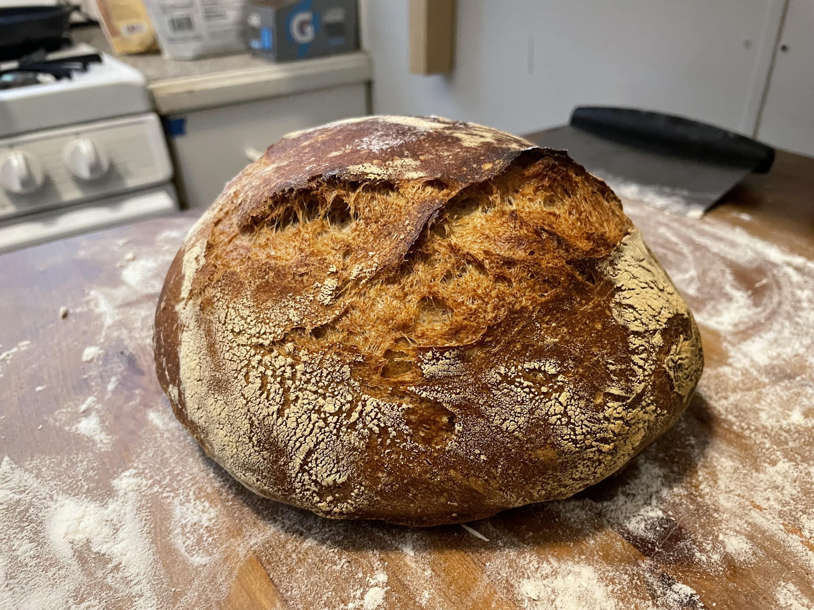
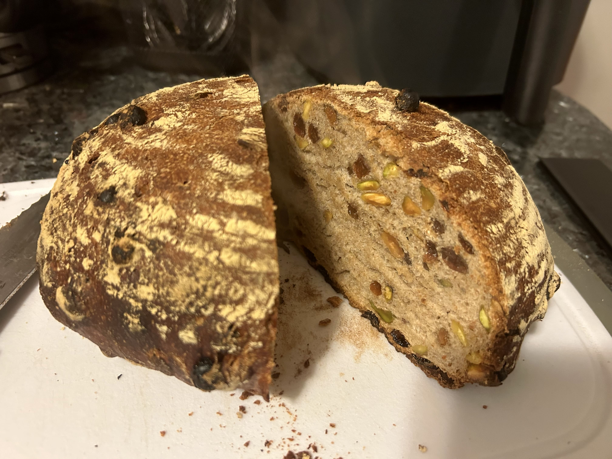

Like everyone else, I started making bread during the COVID-19 pandemic in 2020, but unlike everyone else, I didn't start because of Instagram "influencers."
Instead, I stumbled across a few bread-baking books as the remnants of someone's failed hobby near the front door of my apartment building.
This collection included the famous [*Flour Water Salt Yeast*](https://www.amazon.com/Flour-Water-Salt-Yeast-Fundamentals/dp/160774273X) by Ken Forkish and [*Tartine Bread*](https://a.co/d/0l1pqTt) by Chad Robertson.
I read through the former and was convinced that this would be a fun hobby, particularly through the Boston winter.

I was hooked by the process and aromas.
The resulting bread was delicious, but my awareness of my lack of constraint is one of the biggest deterrents from baking more often.
Nowadays, I'll infrequently bake a boule (normally using a *biga* preferment) over the weekend for my group's Tuesday lunchtime meetings or prepare a few rounds for pizza throughout the week.

I've recently started experimenting with adding dried fruits and nuts in various blends.
Of my attempts, the cranberry with walnuts or pistachios have been delicious (this opinion was supported by my colleagues, too).

