- [x] Copy text from old project page.
- [ ] Add galleries for photos.

My friend from graduate school, Dr. Viktor Ljungström, left me his fishing pole and some tackle when he moved back to Sweden 🇸🇪.
This was the catalyst to finally get me into fishing[^1].
I now spend hours a week fishing whenever I can find time in the mornings and evenings.

[^1]: I would have started sooner if I had realized how inexpensive it was to get started. I haven't explicitly priced it out, but I think you could easily get going with good equipment for under $100.

## Locations

### Boston, MA

#### Along the Charles

I live in the South End of Boston, about a mile from the Charles River, so that is where I fish from most often.
There I primarily catch largemouth bass (pictured below), crappie, and perch (the bluegills nip at the lures, but rarely to they hook).
In general, I prefer using lures over bait because I enjoy the interactivity of the method.
I predominately use in-line spinners and soft-plastics.

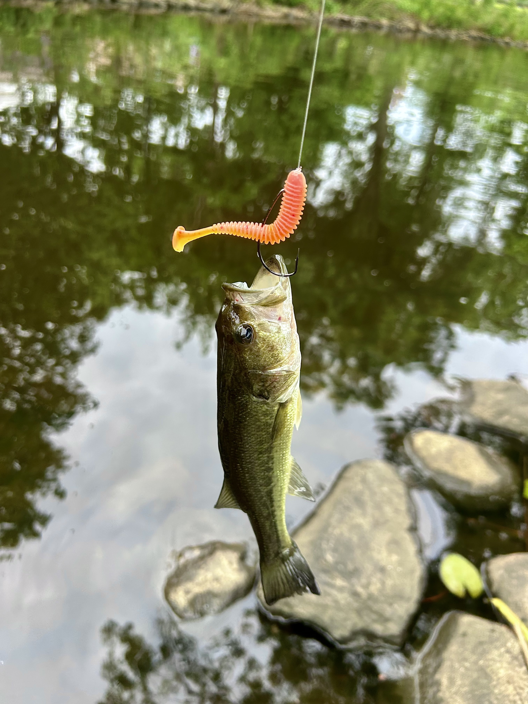

The other week, I nearly tripped over this snapping turtle laying eggs!

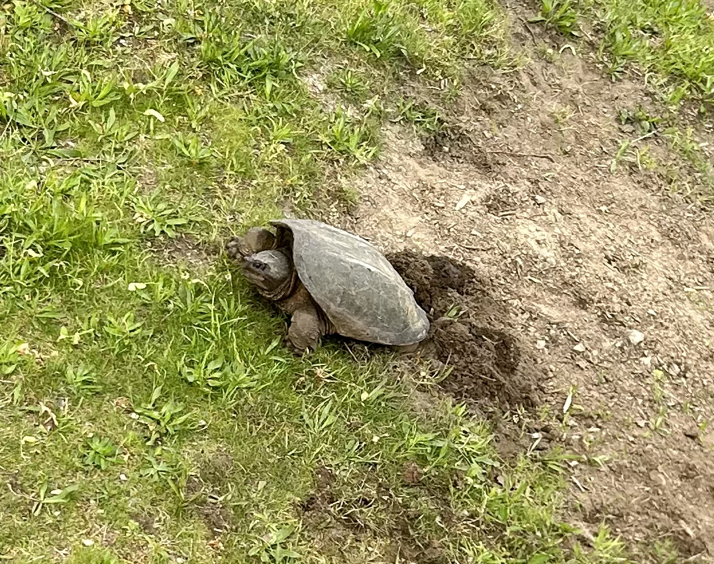

#### Jamaica Pond

On the weekends, I head to Jamaica Pond in search of trout.
This artificial reservoir is stocked with trout in the spring making it a very popular target of the locals.
I have yet to successfully catch one, but I have no mind to give up.
I have caught a couple of largemouths, one of which is pictured below.

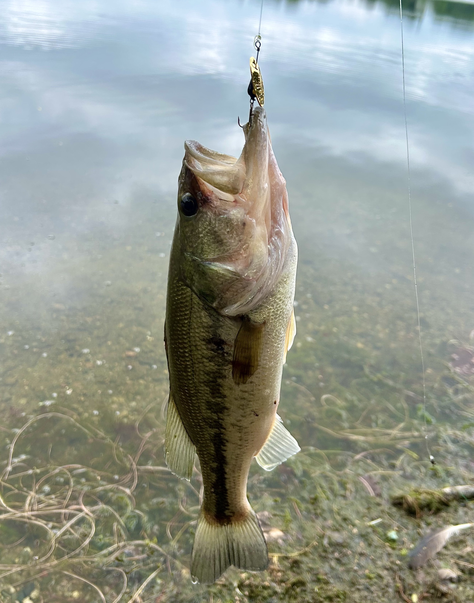

After many hours, I have finally caught a couple of rainbow trout at Jamaica pond in the fall of 2023.
They were both caught on a 1/4 oz. Acme Kastmaster spoon.
These have great action in the water, and the weight made it possible to cast to deeper water.

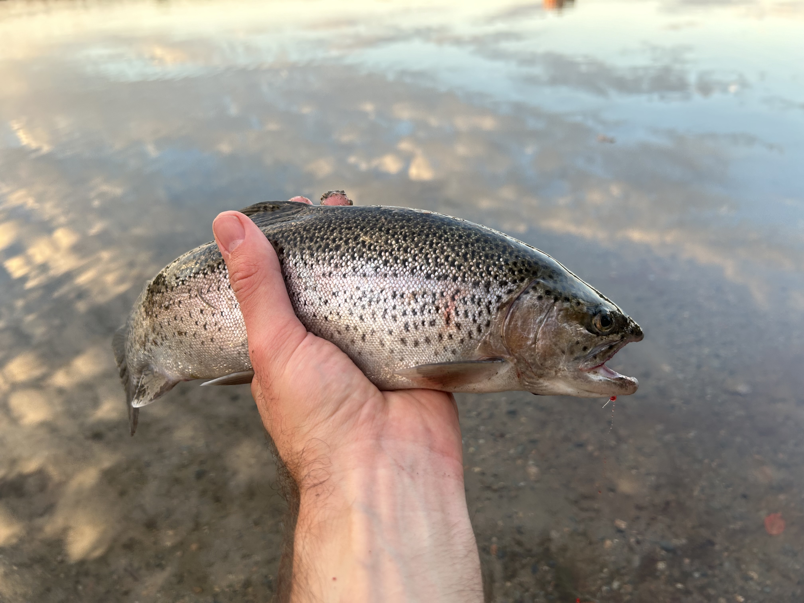

### Wompatuck State Park, MA

I went for a weekend camping trip to Wompatuck State Park, a 45 minute train ride south of Boston.
I spent a Saturday afternoon and entire Sunday fishing the reservoir, catching largemouths and crappie.
I also caught my first chain pickerel, pictured below.

At Wompatuck, I also saw several water snakes.
It was fun to watch them swim and look for prey.

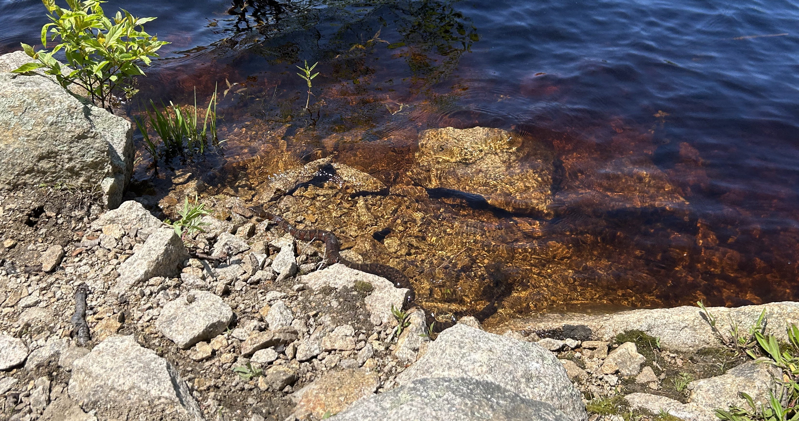

### Concord, MA

I have taken a few trips up to Concord and West Concord, MA this fall.
I take the commuter train up and then bike around for the day, fishing where I can (I do some scouting online beforehand to look for potential spots.)
I haven't caught much, the normal perch and bluegill bite every now and then.
I did catch my first two [fallfish](https://dwr.virginia.gov/blog/fallfish-little-tarpon-of-the-commonwealth/) on these trips though.
Didn't know what there were when I reeled them in and had to search for them during my lunch (I try to treat myself to a nice lunch at a charming cafe on these day trips).
Fun fact, they are the largest minnow native to the Northeast of the U.S.

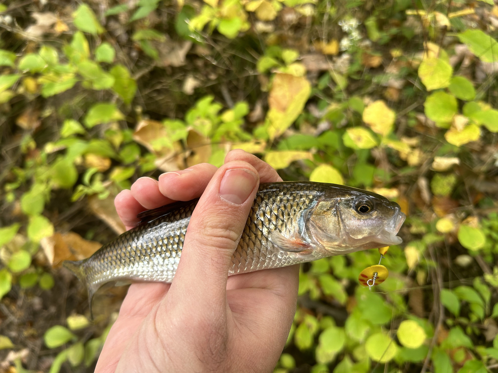

### Yellowstone National Park, WY

I had the fortunate opportunity to visit my girlfriend in Yellowstone National Park in 2023 for a weekend and did a little fishing when I had the opportunity.
I don't fly fish (though I think I want to give that a shot next season) and I didn't hit the major spots along the key rivers or the lake, but I still found beautiful places in the Park to have an adventure.

My girlfriend and I gave it a shot at Cascade Lake, but came up empty.
Beautiful hike and scenery though.
Also got to watch an osprey dive after prey a few times.
We were staying in Mammoth near the hot springs, so I took a day when she was working to hike down and fish along the Gardiner River.
I had some luck there, catching six small trout in total, keeping four that I was sure weren't the native, protected cut throat, but were instead either brook or rainbow non-natives.
They were small, but I enjoyed cooking them for dinner.

These first fish were easy to identify as two brook trout and a rainbow.

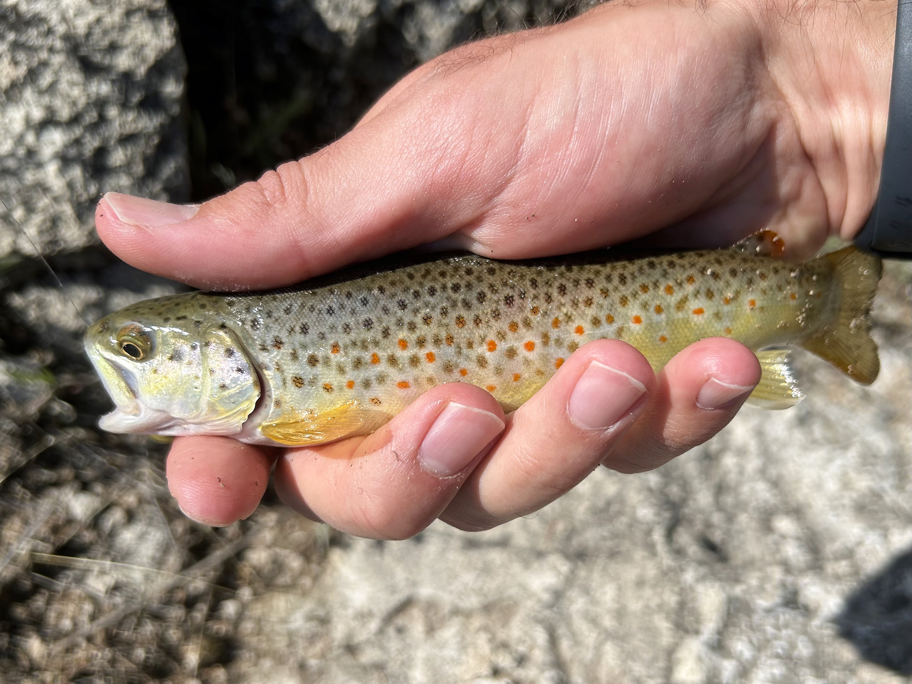
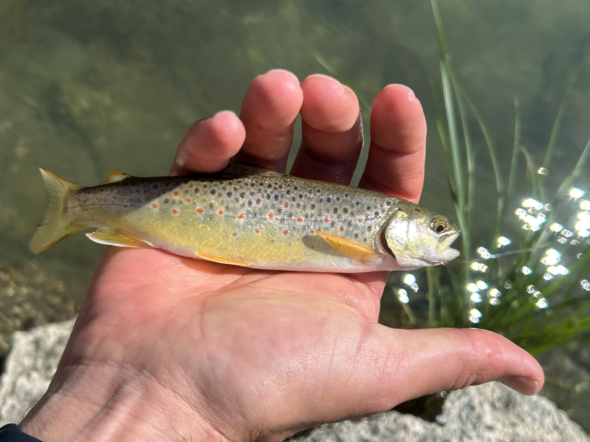
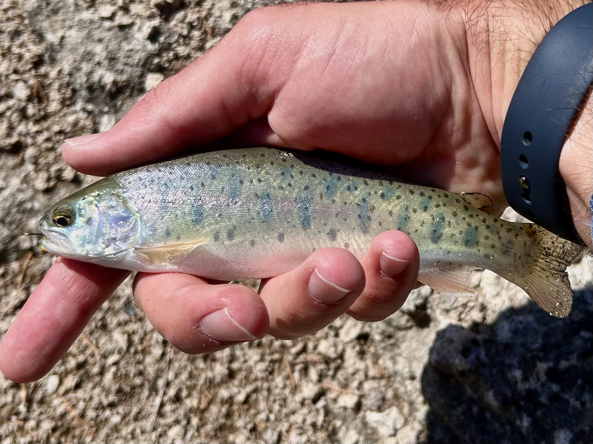

But this last fish had a hint of cut throat.
At this juvinille stage, not all of the diagnositic coloration and markings have developed, so identification can be tricky.
An added challenge is that there is hybridization with rainbow trout, where the offspring have a mixture of the visual features of their parents.
This may have been a cut/rainbow hybrid, in which case I wouldn't have released it, but I couldn't be certain, so I released him.

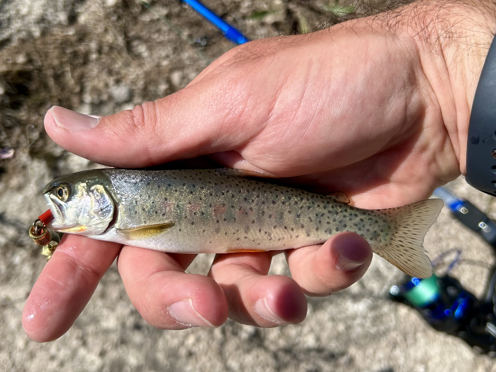

### Tanto National Forest, AZ

I have been able to visit Arizona a few times this year and have gone fishing with my Dad in Tanto National Forest.
We have fished in Verde River at Needle Rock and the Lower Salt River, often accompanied by wild horses, coyotes, and, once, a river otter.
We've caught a few largemouths and bluegill, but I've really been aiming for trout.
I finally caught a rainbow this last trip.
He wasn't huge, but I was overjoyed nonetheless.

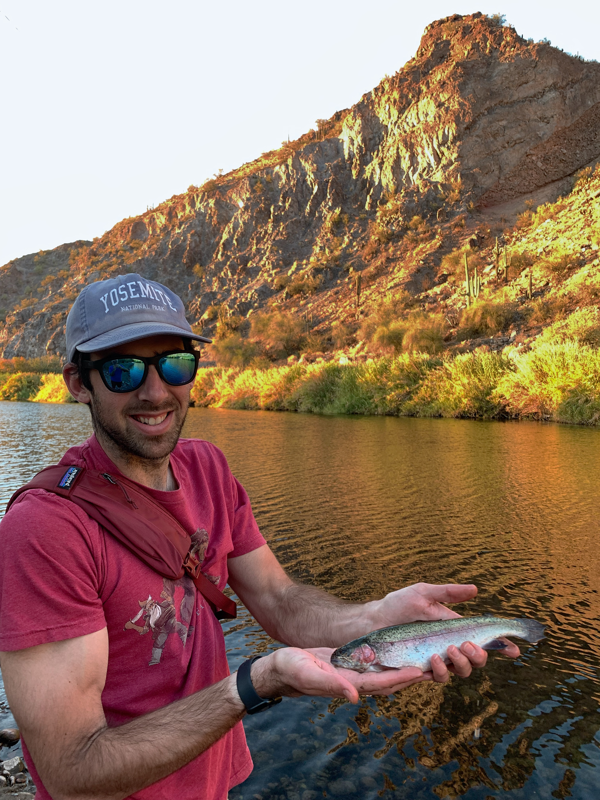
