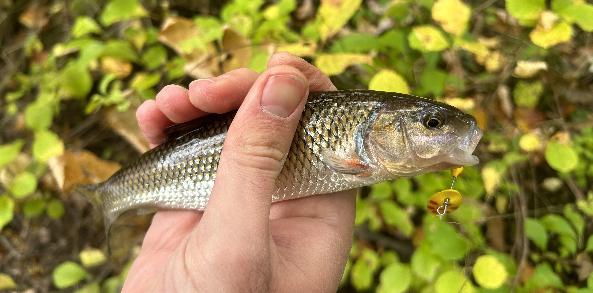

## Getting started

My friend from graduate school, Dr. Viktor Ljungström, left me his fishing pole and some tackle when he moved back to Sweden 🇸🇪.
This was the catalyst to finally get me into fishing[^1].
I fish whenever I can find time in the mornings and evenings.

[^1]: I would have started sooner if I had realized how inexpensive it was to get started. I haven't explicitly priced it out, but I think you could easily get going with good equipment for under $100.

Given I lived in Boston, I started out fishing the Esplanade along the Charles, sometimes riding my bike down to Jamaica Pond where the MA Department of Fish and Game stock trout a few times a year.
A shorter day trip I liked to make every now and then is up to Concord, MA or down to Wompatuck State Park – I'd take my bike on the commuter rail and make a day out of trying different places that look "fishy."


    
    
    


I have also been fortunate to have opportunities to fish in Arizona and Yellowstone National Park.


    
    
    
    
    


## Fly fishing

In 2024, I decided to take up fly fishing.
While progress has been slow, I've definitely been improving.
When I lived on the east coast, my favorite steam was the East Branch of the Pemigewasset River in New Hampshire.
Since I didn't have a car, I would take the Concord Coach Line bus up to Lincoln, walk up to the Lincoln Woods trailhead, and hike up the stream, backpacking over night.
I had mixed success, but on my last trip, I caught a dozen or so native bookies on flies I had tied myself (I was most successful on a gray/black stimulator, black foam beetle, and brown chubby Chernobyl).


    
    
    
    


Just before I left Boston, I made a fishing buddy spontaneously when he saw me fishing on the Esplanade while he was out on a run.
He stopped his run to ask what I was fishing for and, as we got to talking, we swapped phone numbers and agreed to go fishing some time.
We ended up going on two adventures, the first an unsuccessful attempt at stripped bass from the shore, the second to the famous Swift.
There, we had a great time.
Though it was raining here or there, we were on fish, and I caught a monster rainbow and he a good brown trout.


    
    
    


### The Western Native Trout Challenge

I have begun the [Western Native Trout Challenge](https://westernnativetroutchallenge.org/) (unofficially as I have yet to register, though I will likely do so in the future). I have kicked it off with the Gila Trout caught in Dude Creek along the Mogollon Rim in Payson, AZ.
Next, I think, are the three subspecies of Golden Trout in the southern Sierras of California.


    
    
    

