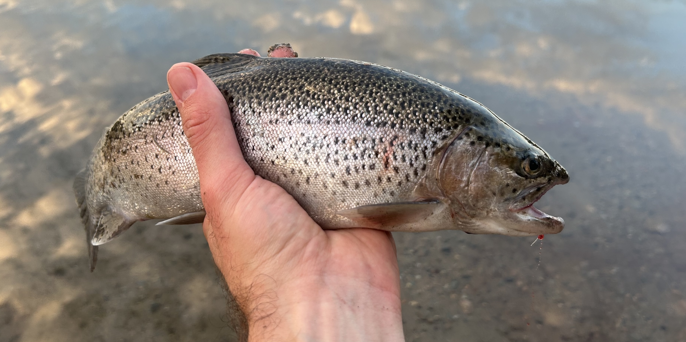

My friend from graduate school, Dr. Viktor Ljungström, left me his fishing pole and some tackle when he moved back to Sweden 🇸🇪.
This was the catalyst to finally get me into fishing[^1].
I fish whenever I can find time in the mornings and evenings.

[^1]: I would have started sooner if I had realized how inexpensive it was to get started. I haven't explicitly priced it out, but I think you could easily get going with good equipment for under $100.

In 2024, I am taking up fly fishing.
I'm keeping a journal of my ventures published to a separate site: [Fly Fishing Journal](https://jhrcook.github.io/fly-fishing-journal/)

Given I live in Boston, I spend most of my time fishing the Esplanade along the Charles, sometimes riding my bike down to Jamaica Pond where the MA Department of Fish and Game stock trout a few times a year.
A shorter trip I like to make every now and then is up to Concord, MA or Wompatuck State Park – I'll take my bike on the commuter rail and make a day out of trying different places that look "fishy."
In addition, I have had the opportunity to fish on some of my trips including to Yellow Stone National Park and Phoenix, AZ.

The gallery below features some of the fish I have caught and, just as important, some of the great scenery I've enjoyed on my adventures.


    
    
    
    
    
    
    
    

