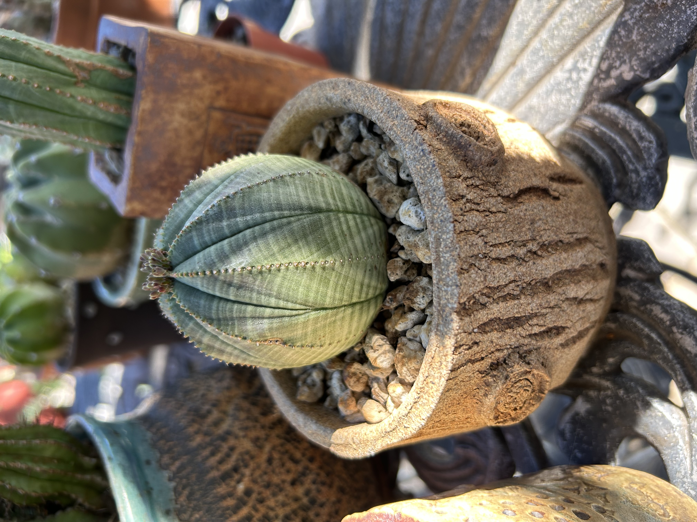

In undergrad, I fostered a love of succulents and cacti.
I love the variety and general ease of care – I have found they can be very hardy once in a good spot.
A large portion of my collection is at my parents home in SoCal, but I have a good number of specimens in my apartment in Boston.
Below is a gallery of some from over the years.




