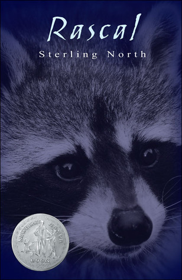
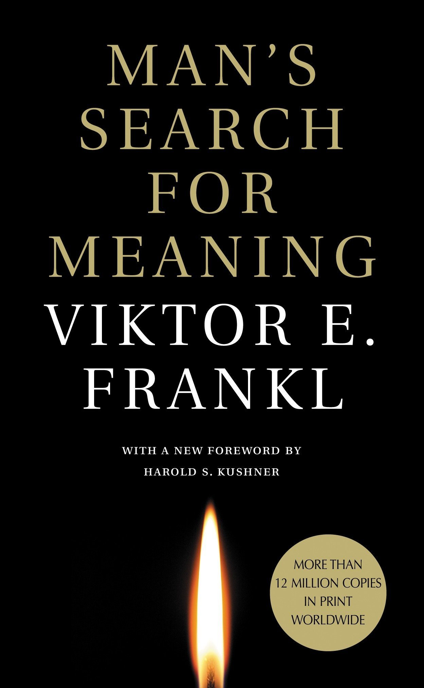
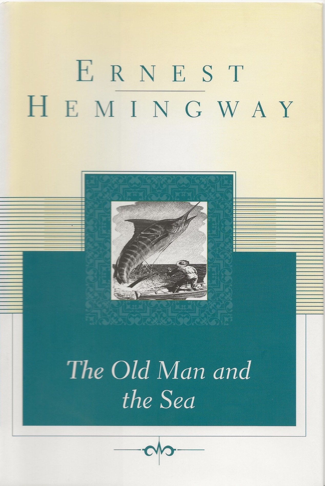

I start every day with coffee and a book.

I read as a way to continually learn.
As a student, this allowed me to diversify my areas of study, and after finishing my (many) years of formal education, I read to resist stagnation.
Importantly, to learn does not require only reading non-fiction.
I believe there is plenty to be learned by great fiction.

Below I have links to my book reviews, organized by the year in which I read the book:

- [2025]()
- [2024]()
- [2023]()

You can see what I have read on either Goodreads or The StoryGraph by following the links below.


 Goodreads

&nbsp;

 The StoryGraph


## Favorites

### All time

#### [*Rascal*](https://amzn.to/4epaCml) by Sterling North

This is a heart-warming story about a boy and his pet racoon and the adventures they embark on over the span of a few years.
I have read this book many times over the years and it always reminds me of childish joy and wonder that is too easy to forget in adulthood.
I would recommend this book to anyone, but particularly for young boys as it really speaks directly to that unique experience.

(As an aside, this book served as the muse for a [popular cartoon](https://en.wikipedia.org/wiki/Rascal_the_Raccoon) in Japan, eventually leading to a boom in the pet racoon market, many of which escaped and caused [an ongoing ecological disaster](https://www.smithsonianmag.com/smart-news/childrens-book-behind-japans-raccoon-problem-180954577/).)

#### [*Man's Search for Meaning*](https://amzn.to/3XvVFZE) by Viktor Frankel

*Man's Search for Meaning* is a memoir by psychoanalyst Viktor Frankel during his years as prisoner in a Nazi concentration camp.
His unique expertise and background provides tremendous insight into humanity through this particularly tragic experience.
This book provides a sobering analysis of the brutal realities of the most fundamental features of human nature and is a must read for anyone seeking to better understand themselves and others.

#### [*The Old Man and the Sea*](https://amzn.to/3XqXYxq) by Ernest Hemingway

For whatever reason, this classic short story struck a chord in me.
What stood out to me was the description of greatness and how it often involves suffering alone.
I don't claim to have undergone this experience, but I appreciated this novel analysis and beautifully remorse description of achievement and excellence.

### Year-end Reviews


 


---

Please note that the Amazon links on this page are Affiliate links.
Using these links does not change your experience or prices on Amazon, I just get a commission if you purchase the item.
