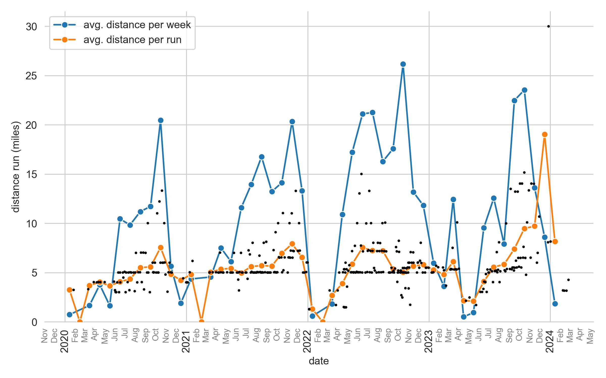


Along with a great excuse to be outside, I enjoy running as a way to challenge myself by increasing my distance and speed over the course of the season.
Also, a hard run is the best mechanism I have found to clear my head.


A midday run is the best solution to clearing up my mind when it feels bogged down or, as I like to describe it, congested.
Sometimes I'm stuck on a problem and thinking about it while I run helps, other times, not thinking about it at all works, too.

In Boston, I run along the Charles which can be gorgeous on a spring, summer, or fall day.
In southern California at my parents house, I look forward to pushing myself on the hills.
And when visiting my parents house in Arizona, I take advantage of the nearby [McDowell Sonoran Preserve](https://www.scottsdaleaz.gov/preserve) and [Tanto National Forest](https://www.fs.usda.gov/tonto/) to run through some beautiful desert trails.

## Stats

Below I have some charts on my running statistics over the last few years.
Since I live in Boston, my running is seasonal – I greatly detest running in freezing weather, so most of my running in the winter is when I'm visiting my parents in California or Arizona.


type: 'bar',
data: {
  labels: ['Jan', 'Feb', 'Mar', 'Apr', 'May', 'Jun', 'Jul', 'Aug', 'Sep', 'Oct', 'Nov', 'Dec'],
  datasets: [
    {
        label: '2020',
        data: [3.24, 0, 7.38, 16.14, 7.32, 44.79, 43.52, 49.55, 50.22, 90.59, 24.21, 8.44],
    },
    {
        label: '2021',
        data: [19.28, 0, 20.14, 32.12, 27.10, 49.71, 61.76, 74.23, 56.66, 62.56, 87.17, 58.86],
    },
    {
        label: '2022',
        data: [2.59, 0, 8.09, 46.69, 76.25, 90.45, 94.10, 72.06, 75.33, 115.87, 56.49, 52.29],
    },
    {
        label: '2023',
        data: [26.35, 14.45, 55.08, 2.16, 4.19, 40.90, 55.59, 34.97, 96.30, 104.20, 58.29, 8.07+30.01],
    },
    {
        label: '2024',
        data: [8.15, ],
    },
    ]
},
options: {
    plugins: {
      title: {
        display: true,
        text: 'Monthly Distance'
      },
      subtitle: {
        display: true,
        text: "My monthly milage over the current and last four years"
      },
      legend: {
        position: 'right',
        title: {
          display: true,
          text: 'year',
        }
      },
    },
    scales: {
      x: {
        title: {
          display: true,
          text: 'month'
        }
      },
      y: {
        title: {
          display: true,
          text: 'distance (miles)'
        },
        min: 0
      }
    }
  }


I strained my Achilles tendon on my right ankle in my last run in March of 2023, so I took off most of April with a single run of 2 very slow and careful miles, then eased back into running in May and June.
Consulting with my podiatrist sister, the injury was probably caused by insufficient strength in my calves and tight Achilles tendon.
My running style – I run on the balls of my feet instead of run heel-toe to reduce the impact on my knees – puts a lot of strain on these components, so I now specifically stretch and strengthen my lower leg.

The following chart shows my pace per month.
It's difficult to see trends here because there are several influencing factors, namely distance (I can maintain a faster pace over 5 miles than 10) and location (I'm much faster running the flat Esplanade along the Charles river than the hills of back home in California).


type: 'line',
data: {
  labels: ['Jan', 'Feb', 'Mar', 'Apr', 'May', 'Jun', 'Jul', 'Aug', 'Sep', 'Oct', 'Nov', 'Dec'],
  datasets: [
    {
        label: '2020',
        data: [7+26/60, , 7+36/60, 7+33/60, 8+27/60, 8+12/60, 8+16/60, 7+54/60, 7+58/60, 8+1/60, 8+2/60, 9+36/60],
        spanGaps: true
    },
    {
        label: '2021',
        data: [8+5/60, , 8+14/60, 7+44/60, 8+14/60, 8+1/60, 7+52/60, 7+50/60, 7+24/60, 7+40/60, 7+36/60, 7+49/60],
        spanGaps: true
    },
    {
        label: '2022',
        data: [8+17/60, , 6+54/60, 8+21/60, 7+43/60, 7+35/60, 7+47/60, 7+43/60, 7+43/60, 7+58/60, 8+4/60, 8+12/60],
        spanGaps: true
    },
    {
        label: '2023',
        data: [7+40/60, 7+38/60, 7+39/60, 9+3/60, 7+49/60, 7+41/60, 7+35/60, 7+39/60, 7+55/60, 8+1/60, 8+4/60, 7+43/60],
        spanGaps: true
    },
    {
        label: '2024',
        data: [8+20/60],
        spanGaps: true
    },
  ]
},
options: {
    plugins: {
      title: {
        display: true,
        text: 'Average Pace'
      },
      subtitle: {
        display: true,
        text: "My average pace per month (a lower value is faster)."
      },
      legend: {
        position: 'right',
        title: {
          display: true,
          text: 'year',
        }
      },
    },
    scales: {
      x: {
        title: {
          display: true,
          text: 'month'
        }
      },
      y: {
        title: {
          display: true,
          text: 'pace (min. / mile)'
        },
      }
    }
  }


## Favorite Gear

> Note that the links may break as new models are released and old models are retired. The links to Amazon products are affiliate links and I earn a small commission on items you purchase.

### Road shoes: [Brooks Ghost](https://amzn.to/3VneN9D)

The Ghost is a tried-and-true model.
I have been running in Ghost models since 2018[^1] and have had no issues.
I've experimented with other Brooks models and other makers every now and then, but none have been as comfortable.

The current MSRP is $140, but I have regularly been able to find them discounted on sales by Brooks, Zappos, or REI at or below $100.
The previous year's model is often available a bit cheaper, too.
Recently, I picked up a basically new pair of Ghost 14 on their used gear site, [Brooks Restart](https://restart.brooksrunning.com) (supposedly there is some discoloration, but I don't see anything).

[^1]: The current model in February of 2024 is version 15 and I've used versions 10 (2018), 11 (2020), 13 (2021), and 14 (2023).

### Trail shoes: [Brooks Cascadia](https://amzn.to/3KJeBg1)

I'm fairly new to trail runners.
When shopping for my first pair, I started with Cascadia because of my success with the Ghosts and the similarity between these models of shoe.
I would like to experiment with other makes and models, but for now I can stand by the Cascadia.

The Cascadia is comfortable and provides great traction and protection (I've stepped on plenty of sharp rocks and cacti while running on trails in Arizona).
The toe box is a good width for me – I usually order the wide version of the Ghost and these seem to be about that width at their standard sizing.

As with the Brooks, the current MSRP is a not cheap at $140, but I can find them on sale or previous versions for closer to $100.
For instance, I picked up another pair of version 16 for $70 in a closeout sale on Brooks' website.

### Watch: [Apple Watch Series 8](https://amzn.to/4ehyOax)

I started with the Series 3 and when that had battery issues and its CPU was out-matched by watchOS, I upgraded to the Series 8.
Overall, both have been great with the Series 8 bringing many enhancements and an improved user experience.
There are many great features of the Apple Watch that I won't enumerate here because they are covered well elsewhere.
I will say that I'm not wed to this device; it has short comings that, when the time comes, will cause me to conduct a survey of the smart watch and fitness tracker market.

### Pack: [Solomon ADV Skin 5](https://amzn.to/4c07Oux)

My first running pack/vest was a relatively cheap Nathan model that was on sale.
It was a good starter to see if I was interested in using it for longer runs, but it used a water bladder in the back that eventually leaked (two bladders I tried eventually leaked, and the one the pack actually came with is very difficult to actually drink from).
So I eventually decided to upgrade and look for a pack with front flasks for water storage.

I spent a lot of time researching various running packs and vests, then ordered a few and went to REI to try on the top contenders, and the Solomon ADV Skin was easily the best.
It is very comfortable and holds to the body securely.
All of the others had compromises on fit and function.
I found it fits to my body the best out of the models I tried and, in addition, it was the only one with an accessible zippered pocket that could hold a cell phone securely.
This pack is also sold with two flasks which usually retail for around $20 each, so that should be accounted for when shopping around.

Were I looking to upgrade, I would consider getting a larger capacity (perhaps the [12 L version](https://amzn.to/3VsoQu6)) because they cinch down well when not full, but can carry more food and water for longer runs.

(I also have the 25 L [Loris](https://www.gossamergear.com/products/loris) from Gossamer Gear that I want to try running with for my commute, but I am waiting for them to restock the belt.)

### Shorts: [Brooks Sherpa 2-in-1 Running Shorts](https://amzn.to/3VntZ6U)

These are very comfortable and have good storage options for holding keys, snacks, and other small items for those intermediate distance runs.
The zippered leg pocket is build into the compression shorts, so it holds against the leg, making it comfortable to carry a phone.

### Glasses: [Goodr](https://amzn.to/3RtJA3x)

These glasses are great because they are relatively cheap, light, polarized, and stylish.
The main selling feature over other cheap glasses is that they don't bounce when I run.
My go-to style is the OG style in [Ginger's Soul](https://amzn.to/3RtJA3x) black.

### Energy gels: [Huma Gels Plus](https://amzn.to/3RvhqFj)

I have experimented with a few different options, but don't have enough experience to provide strong recommendations on energy gels.
I will say, though, that having these energy gels makes a massive difference on longer runs (anything over an hour).
Having one or two of these on a 14-mile run makes a massive difference in pushing at the end[^2].
I highlight the Huma Plus gels here though because they provide electrolytes while most other gels provide only energy and caffeine.

[^2]: Assuming you've remained hydrated, of course.
