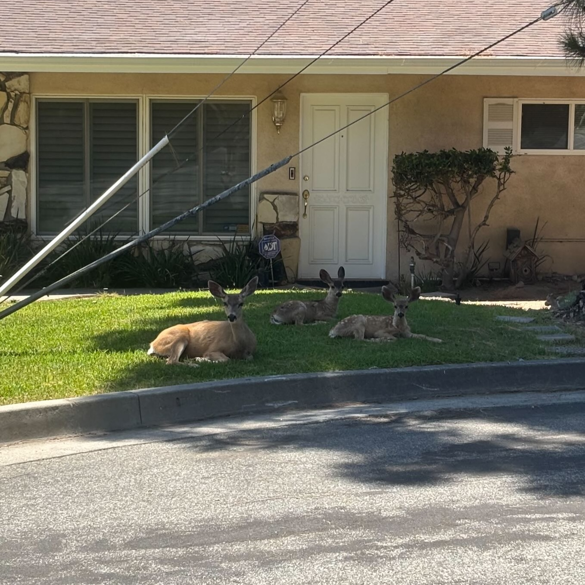
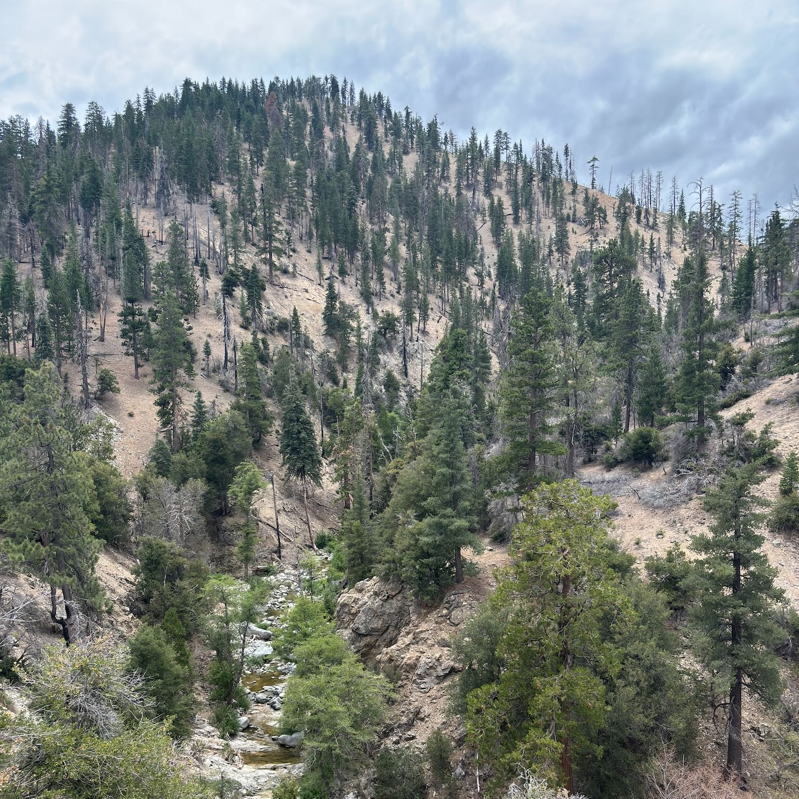


Along with being a great excuse to be outside, I enjoy running as a way to challenge myself by increasing my distance and speed over the course of the season.
Also, a hard run is the best mechanism I have found to clear my head.


A midday run is the best solution to clearing up my mind when it feels bogged down or, as I like to describe it, congested.
Sometimes I'm stuck on a problem and thinking about it while I run helps, other times, not thinking about it at all works, too.

In Boston, I loved running along the Charles which can be gorgeous on a spring, summer, or fall day (but absolute brutal during the winter).
In southern California, I train on the hills of Angeles Crest.
And when visiting my parents house in Arizona, I take advantage of the nearby [McDowell Sonoran Preserve](https://www.scottsdaleaz.gov/preserve) and [Tanto National Forest](https://www.fs.usda.gov/tonto/) to run through some beautiful desert trails.


    
    
    
    
    
    


## Favorite Gear

> Note that the links may break as new models are released and old models are retired. The links to Amazon products are affiliate links and I earn a small commission on items you purchase.

### Road shoes: [Brooks Ghost](https://amzn.to/3VneN9D)

The Ghost is a tried-and-true model.
I have been running in Ghost models since 2018 without issue.
I've experimented with other Brooks models and other brands every now and then, but none have been as comfortable.

The current MSRP is $140, but I have regularly been able to find them discounted on sales by Brooks, Zappos, or REI at or below $100.
The previous year's model is often available a bit cheaper, too.
Usually, I can pick up a all-but brand new pair from Brooks' used/returned gear site, [Brooks Restart](https://restart.brooksrunning.com).

### Trail shoes: [Brooks Cascadia](https://amzn.to/3KJeBg1)

The Cascadia model line is essentially the trail version of the Ghost line.
I've tried a Topo Athletics model with zero drop, but I think they contributed to my plantar fasciitis, so now I just stick with the Cascadia.

The Cascadia is comfortable and provides great traction and protection (I've stepped on plenty of sharp rocks and cacti while running on trails in Arizona).
The toe box is a good width for me – I usually order the wide version of the Ghost and these seem to be about that width in the standard sizing of Cascadia.

As with the Ghost, I can find them on sale or previous versions for close to $100.

### Watch: [Coros Pace Pro](https://coros.com/pacepro)

My first and second smart watches were Apple Watches.
While a good entry level running watch and a good smart watch for more general use, it is lacking in a few ways.
As I've been running longer and longer distances, I began to hit the limit of the battery of the Apple Watch.
Even running with the always-on screen off, I was finishing runs with 10% or so percent left of the battery.
Also, I only use the smart watch for exercise and sleeping, otherwise wearing a [traditional watch](), so all of the other smart watch features were useless distractions to me.

Thus, I decided to upgrade to a more running-focused watch.
After much research, I decided on the Coros Pace Pro.
There are many great features, but here are the handful that swayed my decision:

1. Stellar battery life
2. Maps and navigation
3. High-accuracy GPS
4. No bloat from unwanted smart watch features (e.g., notifications, social media)
5. Bright, high-resolution, responsive AMOLED screen

In the end, the price-to-useful-features ratio was perfect for me.
Many of the other offerings from Garmin, etc. are great products, but this fit my needs perfectly and at a much lower price.
I've been running with the Coros Pace Pro for several months now and love it.

### Pack: [Solomon ADV Skin 5](https://amzn.to/4c07Oux)

My first running pack/vest was a relatively cheap Nathan model that was on sale.
It was a good starter to see if I was interested in using it for longer runs, but it used a water bladder in the back that eventually leaked (two bladders I tried eventually leaked, and the one the pack actually came with is very difficult to actually drink from).
So I eventually decided to upgrade and look for a pack with front flasks for water storage.

I spent a lot of time researching various running packs and vests, then ordered a few and went to REI to try on the top contenders, and the Solomon ADV Skin was easily the best.
It is very comfortable and holds to the body securely.
All of the others had compromises on fit and function.
I found it fits to my body the best out of the models I tried and, in addition, it was the only one with an accessible zippered pocket that could hold a cell phone securely.
This pack is also sold with two flasks which usually retail for around $20 each, so that should be accounted for when shopping around.

Were I looking to upgrade, I would consider getting a larger capacity (perhaps the [12 L version](https://amzn.to/3VsoQu6)) because they cinch down well when not full, but can carry more food and water for longer runs.

### Belt: [Raide Research LF 2L running belt](https://raideresearch.com/products/lf-2l)

This is another recent purchase that I have taken on a handful of runs, mostly medium length road runs, but one long trail run up in the mountains.
The belt is a great tool to have on hot summer days - particularly on hot, sunny days where I'm doing a medium length (around 8 miles or so) on hills around town.
I can bring about 1 L of water between a small hand-held soft-flask and a 0.6 L flask in the belt, but still be able to take my shirt off to stay cool.
Though pricey at $150, the construction is solid, it has every feature I want and none I don't, and there is no bounce of the water bottle in the back pouch.
I decided this was an opportunity to "buy once, cry once."
I'm still experimenting with exactly how I organize the belt and how it fits each type of run, but I'm really appreciating the extra water carrying capacity in the heat of summer.

### Shorts: [Terignota Sendero Short](https://terignota.com/products/mens-sendero-short)

I usually wear one of my several pairs of Brooks Sherpa running shorts, but I believe these have been discontinued.
I recently picked up a pair of the Sondero Short from a small company called Terignota and am very impressed.
These are very comfortable and have all of the convenient pockets and pouches for carrying snacks, keys, etc.
They are great quality at a very good price of $29 (as of the summer of 2026).

### Glasses: [Goodr](https://amzn.to/3RtJA3x)

These glasses are great because they are relatively cheap, light, polarized, and stylish.
The main selling feature over other cheap glasses is that they don't bounce when I run.
My go-to style is the OG style in [Ginger's Soul](https://amzn.to/3RtJA3x) black.

### Energy gels: [Huma Gels Plus](https://amzn.to/3RvhqFj) and [Gu Energy Gels](https://www.rei.com/product/610028/gu-energy-gel)

I have experimented with a few different options, and have found them all to be more-or-less the same.
I haven't found huge differences in how they make me *feel* during or after a run.
The primary exception would be the Huma Gels Plus since they have electrolytes – these make a large difference on longer, hotter runs.
In general, these all contain a tons of simple carbs that our body can easily use with minimal digestion.
From there, they vary on flavor and consistency, so it's work experimenting and seeing what you enjoy and your stomach tolerates.

More recently, I will carry a couple of Gu Energy Gels, but predominately rely on candy for simple carbs (I love jelly beans and gummy bears), bring salt tablets for my electrolytes, then other foods if I need more sustenance (*e.g.*, granola/protein bars, banana bread, nuts).
I buy the candy in bulk and weigh out some into zip-lock baggies for individual runs.
Overall, this is far cheaper than using gels and, on longer runs that can get monotonous at times, more enjoyable (I love candy, so this may be biased).
