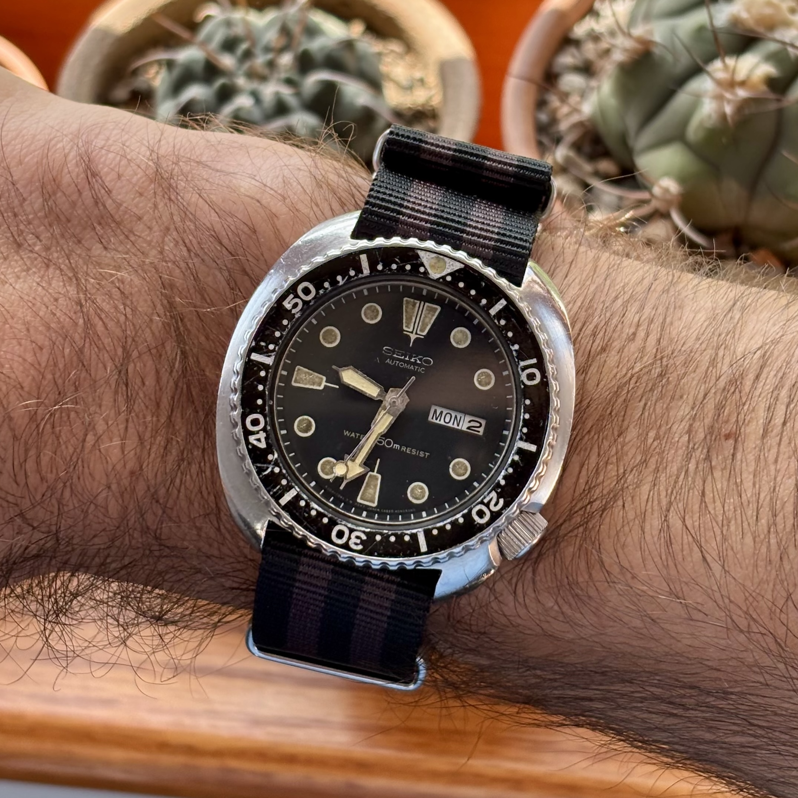

I've been interested in watches for a long time, but only recently had the disposable income to purchase high-quality timepieces.
With this freedom, I've become a nascent watch nerd.

My first ever watch is the class [Timex Expedition](https://timex.com/products/expedition-39mm-fabric-strap-watch-t48061) that my parents agreed to buy for me when I found it in a department store.
I specifically remember wearing this constantly throughout elementary school and using the Indiglo feature when they would take me along on their date-night to the theatre.

In undergrad, I purchased a few quartz watches, most memorably, a [Timex Weekender Chornograph](https://trekbible.com/timex-weekender-chronograph-review/) that I would use to time steps of experiments in lab.
Also at this time, my girlfriend bought me a [Casio A168W](https://www.casio.com/us/watches/casio/product.A168WA-1/) that I cherish to this day.

Early in graduate school, I switched to an Apple Watch, namely for tracking my runs.
I'm now on my second, and while they are great devices (I would have considered them magic at the time I was wearing my Expedition) I felt it was time to wear a proper watch.

My first mechanical watch purchase was a [Seiko SRPE93](https://www.seikowatches.com/us-en/products/prospex/srpe93), a.k.a. the modern "Turtle."
I remember learning about this watch on a podcast in undergrad and still loved this model's style and [history](https://wornandwound.com/deep-dive-the-evolution-of-the-seiko-turtle/) when I went searching for my second "first watch."
And I'm happy to say that I still adore my Turtle and find it such a character-filled piece.
Recently, I was able to acquire an original turtle, the Seiko 6309.
I wear this watch all the time and love the natural patina that a well-used watch gains.

Some other pieces I've acquired include a [Marathon 36 mm SSGPM](https://www.marathonwatch.com/collections/general-purpose-watches/products/officers-watch-gpm-39mm-case-crown-defstan) and a [Seiko Alpinist SPB121](https://seikousa.com/products/spb121).
Both are great watches that I was able to find at good prices second-hand.

I bought my dad a watch for Christmas, too.
This was a fun project as I tried to find one that would match his personality.
I finally decided to go with the [Hamilton Khaki Field King Auto](https://www.hamiltonwatch.com/en-us/h64455533-khaki-field-kingauto.html).
It's a well made Swiss watch, from a historic American brand.
The final cherry on top was this was the watch worn by Hugh Laurie in *House M.D.*

I look forward to acquiring more pieces as I progress through life, carefully selecting pieces that uniquely appeal to me and for special events, achievements, and milestones.

***(Pictures to come!)***





---

As a footnote, I want to mention that, as this passion is more consumptive than productive, I am careful to spend too much time and money and, I more precisely think of this as an *interest* rather than a *hobby*.

Header and thumbnail image credit to *Worn & Wound* in their [Deep Dive on the Turtle](https://wornandwound.com/deep-dive-the-evolution-of-the-seiko-turtle/) model line.
