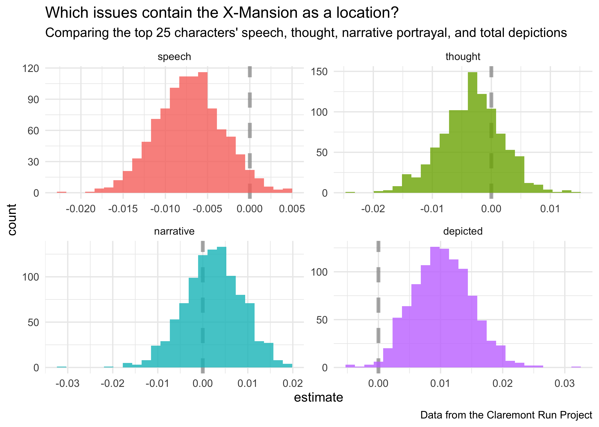
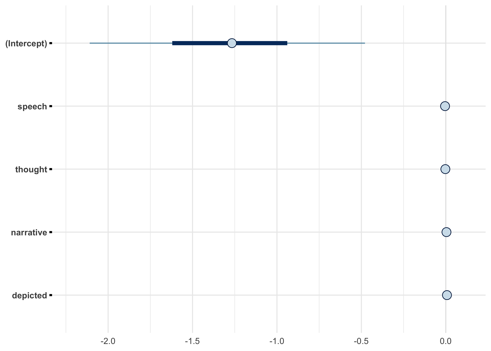
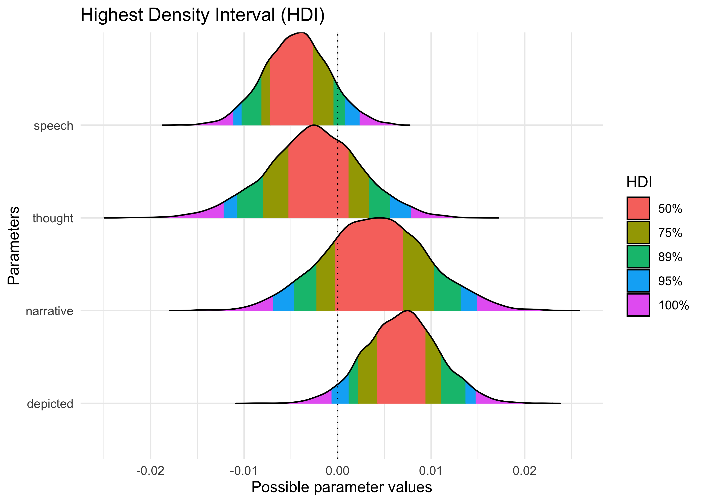
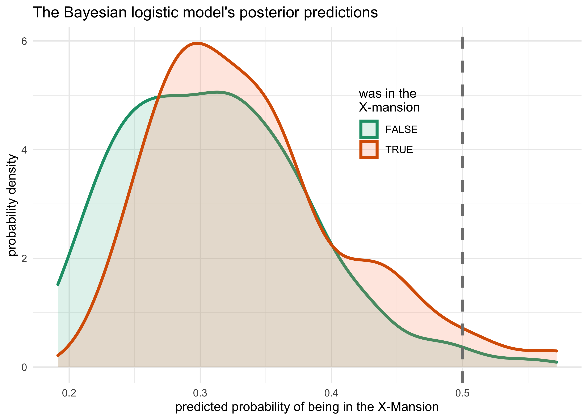
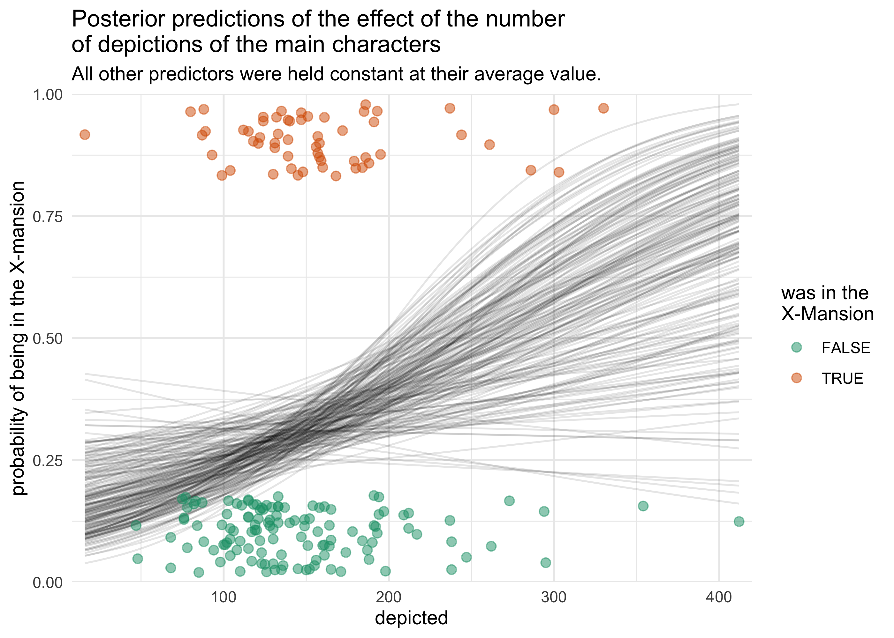

The other day, Dr. Silge from RStudio posted the
[screencast](https://www.youtube.com/watch?v=EIcEAu94sf8&t=1758s) and
[blog post](https://juliasilge.com/blog/uncanny-xmen/) of her
[`#TidyTuesday`](https://github.com/rfordatascience/tidytuesday)
analysis of the Uncanny X-Men data set from [Claremont Run
Project](http://www.claremontrun.com/). In her analysis, she used
logistic regression to model the effect of various features of each
comic book issue on the likelihood of the characters to visit the
X-Mansion at least once. She also built a similar model for whether or
not the comic book issue passed the [Bechdel
test](https://en.wikipedia.org/wiki/Bechdel_test).

One thing that caught my eye was that she used bootstrap re-sampling to
build a distribution of values for each parameter for the models. To me,
this resembled using Markov Chain Monte Carlo (MCMC) sampling methods
for fitting models in Bayesian statistics. Therefore, I thought it would
be interesting to fit the same logistic model (I only analyzed the first
one on visiting the X-Mansion) using Bayesian methods and compare the
results and interpretations.

> Just to be clear, this article is not meant as a criticism of Dr. Silge or her work.
> I greatly enjoy watching her TidyTuesday screencasts, and she seems like a delightful person and strong data scientist.

## Dr. Silge’s analysis

The following was taken from Dr. Silge’s [blog
post](https://juliasilge.com/blog/uncanny-xmen/). I provide brief
explanations about each step, though more information and explanation
can be found in the original article.

### Data preparation

First the data was downloaded from the TidyTuesday GitHub repository and
loaded into R.

``` r
character_visualization <- readr::read_csv("https://raw.githubusercontent.com/rfordatascience/tidytuesday/master/data/2020/2020-06-30/character_visualization.csv")
```

    #> Parsed with column specification:
    #> cols(
    #>   issue = col_double(),
    #>   costume = col_character(),
    #>   character = col_character(),
    #>   speech = col_double(),
    #>   thought = col_double(),
    #>   narrative = col_double(),
    #>   depicted = col_double()
    #> )

``` r
xmen_bechdel <- readr::read_csv("https://raw.githubusercontent.com/rfordatascience/tidytuesday/master/data/2020/2020-06-30/xmen_bechdel.csv")
```

    #> Parsed with column specification:
    #> cols(
    #>   issue = col_double(),
    #>   pass_bechdel = col_character(),
    #>   notes = col_character(),
    #>   reprint = col_logical()
    #> )

``` r
locations <- readr::read_csv("https://raw.githubusercontent.com/rfordatascience/tidytuesday/master/data/2020/2020-06-30/locations.csv")
```

    #> Parsed with column specification:
    #> cols(
    #>   issue = col_double(),
    #>   location = col_character(),
    #>   context = col_character(),
    #>   notes = col_character()
    #> )

Dr. Silge first created the `per_issue` data frame that is a aggregation
over all of the main characters summarizing number of speech bubbles
(`speech`), number of thought bubbles (`thought`), number of times the
characters were involved in narrative statements (`narrative`), and the
total number of depictions (`depicted`) in each issue.

``` r
per_issue <- character_visualization %>%
    group_by(issue) %>%
    summarise(across(speech:depicted, sum)) %>%
    ungroup()

per_issue
```

    #> # A tibble: 196 x 5
    #>    issue speech thought narrative depicted
    #>    <dbl>  <dbl>   <dbl>     <dbl>    <dbl>
    #>  1    97    146      13        71      168
    #>  2    98    172       9        29      180
    #>  3    99    105      22        29      124
    #>  4   100    141      28         7      122
    #>  5   101    158      27        58      191
    #>  6   102     78      27        33      133
    #>  7   103     91       6        25      121
    #>  8   104    142      15        25      165
    #>  9   105     83      12        24      128
    #> 10   106     20       6        20       16
    #> # … with 186 more rows

She also made the `x_mansion` data frame which just says whether each
issue visited the X-Mansion at least once and then joined that with
`per_issue` to create `locations_joined`.

``` r
x_mansion <- locations %>%
    group_by(issue) %>%
    summarise(mansion = "X-Mansion" %in% location)

locations_joined <- per_issue %>%
    inner_join(x_mansion)
```

    #> Joining, by = "issue"

### Modeling

To get a distribution of parameter estimates, Dr. Silge bootstrapped
1,000 versions of `locations_joined` and fit a separate logistic model
to each. She then extracted the coefficients of each model and used the
percentile interval method (`int_pctl()`) to gather estimates and
confidence intervals for the bootstraps.

``` r
set.seed(123)
boots <- bootstraps(locations_joined, times = 1000, apparent = TRUE)

boot_models <- boots %>%
    mutate(
        model = map(
            splits,
            ~ glm(mansion ~ speech + thought + narrative + depicted,
                  family = "binomial", data = analysis(.)
            )
        ),
        coef_info = map(model, tidy)
    )

boot_coefs <- boot_models %>%
    unnest(coef_info)

int_pctl(boot_models, coef_info)
```

    #> # A tibble: 5 x 6
    #>   term          .lower .estimate    .upper .alpha .method   
    #>   <chr>          <dbl>     <dbl>     <dbl>  <dbl> <chr>     
    #> 1 (Intercept) -2.42     -1.29    -0.277      0.05 percentile
    #> 2 depicted     0.00193   0.0103   0.0196     0.05 percentile
    #> 3 narrative   -0.0106    0.00222  0.0143     0.05 percentile
    #> 4 speech      -0.0148   -0.00716  0.000617   0.05 percentile
    #> 5 thought     -0.0143   -0.00338  0.00645    0.05 percentile

The boostrapped distributions are shown below.

``` r
boot_coefs %>%
    filter(term != "(Intercept)") %>%
    mutate(term = fct_inorder(term)) %>%
    ggplot(aes(estimate, fill = term)) +
    geom_vline(
        xintercept = 0, color = "gray50",
        alpha = 0.6, lty = 2, size = 1.5
    ) +
    geom_histogram(alpha = 0.8, bins = 25, show.legend = FALSE) +
    facet_wrap(~term, scales = "free") +
    labs(
        title = "Which issues contain the X-Mansion as a location?",
        subtitle = "Comparing the top 25 characters' speech, thought, narrative portrayal, and total depictions",
        caption = "Data from the Claremont Run Project"
    )
```

<!-- -->

-----

## The Bayesian way

Bayesian modeling is the practice of updating our prior beliefs using
observed data to produce a probability distribtion for the values of
unknown parameters. Thus, unlike the single point-estimates provided by
“frequentist” approaches, the results of a Bayesian analysis are the
distributions of estimated parameters. This is why Dr. Silge’s
bootstrapping analysis reminded by of Bayesian regression modeling.

### The libraries

The [‘rstanarm’](https://mc-stan.org/rstanarm/index.html) package was
used to fit the model, and
[‘tidybayes’](https://mjskay.github.io/tidybayes/),
[‘bayestestR’](https://easystats.github.io/bayestestR/), and
[‘see’](https://easystats.github.io/see/) were used for
investigating the model’s estimates (‘bayestestR’ and ‘see’ are both
from the [‘easystats’](https://github.com/easystats/easystats) suite of
packages).

``` r
library(rstanarm)
library(tidybayes)
library(bayestestR)
library(see)
```

### Fitting the model

The `stan_glm()` function is the ‘rstanarm’ equivalent of `glm()`. The
only additional arguments to include are the prior distributions for the
predictor coefficients and intercept. Here, I kept it simple by using
normal distributions that were not too biased. A thorough analysis would
include a section where the impact of different prior distributions
would be assessed.

``` r
bayes_mansion <- stan_glm(
    mansion ~ speech + thought + narrative + depicted,
    family = binomial(link = "logit"), 
    data = locations_joined,
    prior = normal(location = 0, scale = 0.5),
    prior_intercept = normal(location = 0, scale = 3)
)
```

    #> 
    #> SAMPLING FOR MODEL 'bernoulli' NOW (CHAIN 1).
    #> Chain 1: 
    #> Chain 1: Gradient evaluation took 0.000213 seconds
    #> Chain 1: 1000 transitions using 10 leapfrog steps per transition would take 2.13 seconds.
    #> Chain 1: Adjust your expectations accordingly!
    #> Chain 1: 
    #> Chain 1: 
    #> Chain 1: Iteration:    1 / 2000 [  0%]  (Warmup)
    #> Chain 1: Iteration:  200 / 2000 [ 10%]  (Warmup)
    #> Chain 1: Iteration:  400 / 2000 [ 20%]  (Warmup)
    #> Chain 1: Iteration:  600 / 2000 [ 30%]  (Warmup)
    #> Chain 1: Iteration:  800 / 2000 [ 40%]  (Warmup)
    #> Chain 1: Iteration: 1000 / 2000 [ 50%]  (Warmup)
    #> Chain 1: Iteration: 1001 / 2000 [ 50%]  (Sampling)
    #> Chain 1: Iteration: 1200 / 2000 [ 60%]  (Sampling)
    #> Chain 1: Iteration: 1400 / 2000 [ 70%]  (Sampling)
    #> Chain 1: Iteration: 1600 / 2000 [ 80%]  (Sampling)
    #> Chain 1: Iteration: 1800 / 2000 [ 90%]  (Sampling)
    #> Chain 1: Iteration: 2000 / 2000 [100%]  (Sampling)
    #> Chain 1: 
    #> Chain 1:  Elapsed Time: 0.22106 seconds (Warm-up)
    #> Chain 1:                0.172703 seconds (Sampling)
    #> Chain 1:                0.393763 seconds (Total)
    #> Chain 1: 
    #> 
    #> SAMPLING FOR MODEL 'bernoulli' NOW (CHAIN 2).
    #> Chain 2: 
    #> Chain 2: Gradient evaluation took 6.3e-05 seconds
    #> Chain 2: 1000 transitions using 10 leapfrog steps per transition would take 0.63 seconds.
    #> Chain 2: Adjust your expectations accordingly!
    #> Chain 2: 
    #> Chain 2: 
    #> Chain 2: Iteration:    1 / 2000 [  0%]  (Warmup)
    #> Chain 2: Iteration:  200 / 2000 [ 10%]  (Warmup)
    #> Chain 2: Iteration:  400 / 2000 [ 20%]  (Warmup)
    #> Chain 2: Iteration:  600 / 2000 [ 30%]  (Warmup)
    #> Chain 2: Iteration:  800 / 2000 [ 40%]  (Warmup)
    #> Chain 2: Iteration: 1000 / 2000 [ 50%]  (Warmup)
    #> Chain 2: Iteration: 1001 / 2000 [ 50%]  (Sampling)
    #> Chain 2: Iteration: 1200 / 2000 [ 60%]  (Sampling)
    #> Chain 2: Iteration: 1400 / 2000 [ 70%]  (Sampling)
    #> Chain 2: Iteration: 1600 / 2000 [ 80%]  (Sampling)
    #> Chain 2: Iteration: 1800 / 2000 [ 90%]  (Sampling)
    #> Chain 2: Iteration: 2000 / 2000 [100%]  (Sampling)
    #> Chain 2: 
    #> Chain 2:  Elapsed Time: 0.188406 seconds (Warm-up)
    #> Chain 2:                0.310647 seconds (Sampling)
    #> Chain 2:                0.499053 seconds (Total)
    #> Chain 2: 
    #> 
    #> SAMPLING FOR MODEL 'bernoulli' NOW (CHAIN 3).
    #> Chain 3: 
    #> Chain 3: Gradient evaluation took 5.3e-05 seconds
    #> Chain 3: 1000 transitions using 10 leapfrog steps per transition would take 0.53 seconds.
    #> Chain 3: Adjust your expectations accordingly!
    #> Chain 3: 
    #> Chain 3: 
    #> Chain 3: Iteration:    1 / 2000 [  0%]  (Warmup)
    #> Chain 3: Iteration:  200 / 2000 [ 10%]  (Warmup)
    #> Chain 3: Iteration:  400 / 2000 [ 20%]  (Warmup)
    #> Chain 3: Iteration:  600 / 2000 [ 30%]  (Warmup)
    #> Chain 3: Iteration:  800 / 2000 [ 40%]  (Warmup)
    #> Chain 3: Iteration: 1000 / 2000 [ 50%]  (Warmup)
    #> Chain 3: Iteration: 1001 / 2000 [ 50%]  (Sampling)
    #> Chain 3: Iteration: 1200 / 2000 [ 60%]  (Sampling)
    #> Chain 3: Iteration: 1400 / 2000 [ 70%]  (Sampling)
    #> Chain 3: Iteration: 1600 / 2000 [ 80%]  (Sampling)
    #> Chain 3: Iteration: 1800 / 2000 [ 90%]  (Sampling)
    #> Chain 3: Iteration: 2000 / 2000 [100%]  (Sampling)
    #> Chain 3: 
    #> Chain 3:  Elapsed Time: 0.159436 seconds (Warm-up)
    #> Chain 3:                0.220296 seconds (Sampling)
    #> Chain 3:                0.379732 seconds (Total)
    #> Chain 3: 
    #> 
    #> SAMPLING FOR MODEL 'bernoulli' NOW (CHAIN 4).
    #> Chain 4: 
    #> Chain 4: Gradient evaluation took 1.5e-05 seconds
    #> Chain 4: 1000 transitions using 10 leapfrog steps per transition would take 0.15 seconds.
    #> Chain 4: Adjust your expectations accordingly!
    #> Chain 4: 
    #> Chain 4: 
    #> Chain 4: Iteration:    1 / 2000 [  0%]  (Warmup)
    #> Chain 4: Iteration:  200 / 2000 [ 10%]  (Warmup)
    #> Chain 4: Iteration:  400 / 2000 [ 20%]  (Warmup)
    #> Chain 4: Iteration:  600 / 2000 [ 30%]  (Warmup)
    #> Chain 4: Iteration:  800 / 2000 [ 40%]  (Warmup)
    #> Chain 4: Iteration: 1000 / 2000 [ 50%]  (Warmup)
    #> Chain 4: Iteration: 1001 / 2000 [ 50%]  (Sampling)
    #> Chain 4: Iteration: 1200 / 2000 [ 60%]  (Sampling)
    #> Chain 4: Iteration: 1400 / 2000 [ 70%]  (Sampling)
    #> Chain 4: Iteration: 1600 / 2000 [ 80%]  (Sampling)
    #> Chain 4: Iteration: 1800 / 2000 [ 90%]  (Sampling)
    #> Chain 4: Iteration: 2000 / 2000 [100%]  (Sampling)
    #> Chain 4: 
    #> Chain 4:  Elapsed Time: 0.169659 seconds (Warm-up)
    #> Chain 4:                0.129054 seconds (Sampling)
    #> Chain 4:                0.298713 seconds (Total)
    #> Chain 4:

### Model evaluation

Now that the model is fit, the next step is to inspect the posterior
distributions of the coefficients.

``` r
plot(bayes_mansion, prob = 0.50, prob_outer = 0.89)
```

<!-- -->

Each dot represents the mean of the posterior distribution for the
coefficient along with the 50% and 89% density intervals. We can see
that the intercept is quite large and negative, indicating that, on
average, the X-Men tended to not visit the X-Mansion. Comparably, the
distributions for the other coefficients are very small and located
close to 0. This suggests that they do not poses much additional
information on whether or not the X-Men visited the X-Mansion.

Another useful plot in Bayesian analysis is of the Highest Density
Interval (HDI), the smallest range of parameter values that hold a given
density of the distribution. With the 89% HDI for a posterior
distribution, we can say that, given the structure of the model and
observed data, there is an 89% chance that the real parameter value lies
within the range. This is one method for understanding the confidence of
the estimated value.

``` r
plot(bayestestR::hdi(bayes_mansion, ci = c(0.5, 0.75, 0.89, 0.95)))
```

<!-- -->

From the HDI shown above, we can see that the coefficients for the
number of speech bubles (`speech`) and number of times the characters
were depicted `depicted` in an issue were the strongest predictors. The
89% HDI for `speech` includes 0 while the 95% HDI for `depicted`
includes 0. Therefore, none of these posterior distributions are
particularly exciting as they are all very small (in conjunction with a
strong intercept) and have a fair chance of actually being 0.

Two other measurements that are useful for Bayesian analysis are the
*propbability of direction* (PD) and the *region of practical
equivalence* (ROPE). Without going too in-depth, the PD is the
probability that a parameter is positive or negative. It ranges from 0.5
to 1, a value of 1 indicates it is definitely positive or negative
(i.e. non-zero). The ROPE is a similar value but accounts for effect
size by measuring how much of the posterior distribution lies within a
region that we (the analysts) would say is effectively zero. Thus, if
the ROPE is high, then it is unlikely that the parameter’s value has
much importance.

The following table provides a summary of the posterior distributions
for this model.

``` r
bayestestR::describe_posterior(bayes_mansion)
```

    #> Possible multicollinearity between depicted and speech (r = 0.7). This might lead to inappropriate results. See 'Details' in '?rope'.

    #> # Description of Posterior Distributions
    #> 
    #> Parameter   | Median |           89% CI |    pd |        89% ROPE | % in ROPE |  Rhat |      ESS
    #> ------------------------------------------------------------------------------------------------
    #> (Intercept) | -1.267 | [-2.095, -0.467] | 0.997 | [-0.181, 0.181] |         0 | 1.000 | 5612.356
    #> speech      | -0.004 | [-0.010,  0.001] | 0.900 | [-0.181, 0.181] |       100 | 1.001 | 2401.035
    #> thought     | -0.003 | [-0.011,  0.006] | 0.697 | [-0.181, 0.181] |       100 | 1.001 | 2865.077
    #> narrative   |  0.004 | [-0.005,  0.013] | 0.771 | [-0.181, 0.181] |       100 | 1.000 | 3264.987
    #> depicted    |  0.007 | [ 0.001,  0.014] | 0.961 | [-0.181, 0.181] |       100 | 1.000 | 2219.555

We can see that even though the PD for `speech` and `depicted` are close
to 1.0 indicating they are likely non-zero, the “% in ROPE” is 100%
suggesting the differences are unimportant.

### Posterior predictive checks

The last step of this analysis is to make predictions using the model.
First, we can make predictions on the provided data to see how well the
model fit the data. Second, we can input new data points that are
interesting to us to see how they impact the model’s predictions.

The plot below shows the distribution of posterior predictions on the
original data. The plotted values are the predicted probability that the
X-Mansion was visited in the comic book issue, separated by whether or
not the X-Mansion was actually visited. The two distributions look
almost identical. This is not surprising because the coefficients fit to
the variables were so small, they do not provide much additional
information for the prediction. Therefore, the model is primarily
relying upon the intercept to calculate an estimate.

``` r
# From the 'rethinking' package.
logistic <- function (x) {
    p <- 1/(1 + exp(-x))
    p <- ifelse(x == Inf, 1, p)
    return(p)
}

locations_joined %>%
    mutate(mansion_predict = logistic(predict(bayes_mansion))) %>%
    ggplot(aes(x = mansion_predict, color = mansion, fill = mansion)) +
    geom_density(size = 1.2, alpha = 0.2) +
    geom_vline(xintercept = 0.5, size = 1.2, lty = 2, color = grey) +
    scale_color_brewer(palette = "Dark2") +
    scale_fill_brewer(palette = "Set2") +
    theme(legend.position = c(0.65, 0.73)) +
    labs(x = "predicted probability of being in the X-Mansion",
         y = "probability density",
         title = "The Bayesian logistic model's posterior predictions",
         color = "was in the\nX-mansion",
         fill = "was in the\nX-mansion")
```

<!-- -->

The second common type of posterior prediction is to make data that
varies one or two variables and holds the rest of the variables
constant. Since `depicted` had the largest predicted effect of the
non-intercept coefficients, I decided to conduct this posterior
predictive check on the values of this variable. Therefore, I created
the `pred_data` data frame which has 100 values across the range of
`depicted` and just the average values for the rest of the variables.
Making predictions on this artifical data set will show the effect of
the `depicted` variable while holding the other variables constant.

Using the `add_fitted_draws()` function from ‘tidybayes’, 200
predictions were made for the artificial data.

``` r
pred_data <- locations_joined %>%
    summarise(across(issue:narrative, mean)) %>%
    mutate(depicted = list(modelr::seq_range(locations_joined$depicted, n = 100))) %>%
    unnest(depicted) %>%
    add_fitted_draws(bayes_mansion, n = 200)

pred_data
```

    #> # A tibble: 20,000 x 10
    #> # Groups:   issue, speech, thought, narrative, depicted, .row [100]
    #>    issue speech thought narrative depicted  .row .chain .iteration .draw .value
    #>    <dbl>  <dbl>   <dbl>     <dbl>    <dbl> <int>  <int>      <int> <int>  <dbl>
    #>  1  189.   143.    44.2      48.7       16     1     NA         NA     1 0.125 
    #>  2  189.   143.    44.2      48.7       16     1     NA         NA     6 0.143 
    #>  3  189.   143.    44.2      48.7       16     1     NA         NA    15 0.117 
    #>  4  189.   143.    44.2      48.7       16     1     NA         NA    47 0.0890
    #>  5  189.   143.    44.2      48.7       16     1     NA         NA    86 0.272 
    #>  6  189.   143.    44.2      48.7       16     1     NA         NA   118 0.101 
    #>  7  189.   143.    44.2      48.7       16     1     NA         NA   131 0.158 
    #>  8  189.   143.    44.2      48.7       16     1     NA         NA   133 0.279 
    #>  9  189.   143.    44.2      48.7       16     1     NA         NA   140 0.0990
    #> 10  189.   143.    44.2      48.7       16     1     NA         NA   154 0.109 
    #> # … with 19,990 more rows

The following plot shows the logistic curves for the artificial data.
Each curve represents an individual prediction over the range of
`depicted` values. The original data is also plotted on top.

``` r
# Just to shift the `mansion` values for plotting purposes.
locations_joined_mod <- locations_joined %>%
    mutate(mansion_num = as.numeric(mansion) + ifelse(mansion, -0.1, 0.1))
    

pred_data %>%
    ggplot(aes(x = depicted, y = .value)) +
    geom_line(aes(group = .draw), alpha = 0.1) +
    geom_jitter(aes(y = mansion_num, color = mansion), 
                data = locations_joined_mod, 
                height = 0.08, width = 0,
                size = 2.2, alpha = 0.5) +
    scale_color_brewer(palette = "Dark2") +
    scale_x_continuous(expand = expansion(mult = c(0.02, 0.02))) +
    scale_y_continuous(expand = c(0, 0), limits = c(0, 1)) +
    labs(x = "depicted",
         y = "probability of being in the X-mansion",
         color = "was in the\nX-Mansion",
         title = "Posterior predictions of the effect of the number\nof depictions of the main characters",
         subtitle = "All other predictors were held constant at their average value.")
```

<!-- -->

We can see that there is a general tendency for the model to predict
that the episode visited the X-Mansion as the value for depicted
increases, but it is a very gradual sinusoidal curve because the
posterior distribution was located so close to zero. We can also see how
the curve is shifted closer to 0 for most values of `depicted`. This is
because of the strong intercept value.

-----

## Wrapping-up

Overall, I think that is was an interesting comparison between a
frequentist approach to building a distribution of coefficient values
and the Bayesian method of analyzing a model. I am not in the position
to provide a theoretical comparison between the two approaches, though I
would say that, personally, interpreting the Bayesian posterior
distribution is more intuitive than interpreting the bootstrapped
distribution.
