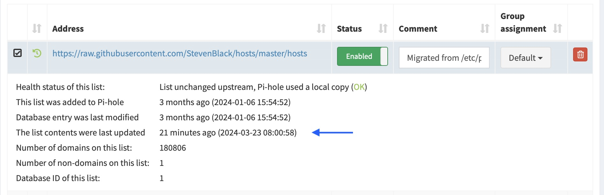

This post is a departure from my normal tutorial or list style blogs, and instead describes my Saturday morning adventure of tracking down the cause of weird behavior on my Pi-hole DNS.
After figuring out the problem, I did my best to record the steps, including capturing terminal output that I used to diagnose the issue, though some was collected after-the-fact, but is still illustrative.

Before getting into the story, just a brief description of Pi-hole is warranted for the uninitiated (or those with better things to do than tinker with random bits of software on their weekends).
As described in the [Pi-hole documentation](https://docs.pi-hole.net), "the Pi-hole is a DNS sinkhole that protects your devices from unwanted content, without installing any client-side software."
It's a powerful ad-blocker that blocks slow, creepy, and obtrusive requests made by websites, apps, etc. on your computer.
Once linked to the internet router, it automatically protects anyone on the local internet system without any setup or configuration required.
Truly a great addition to any nerd's home setup.

The ignition for this episode came mid-week as I was checking my Pi-hole's dashboard (as one does) and noticed that the ad-lists, remote source URLs and patterns to add to the Pi-hole's blocklist, had been updated more recently than expected.
My Pi-hole runs in a docker container on a Raspberry Pi and I have a cron job that prompts it to update its ad-lists every morning at 1 AM (when that additional activity on the little computer is least likely to be obtrusive to it's user-facing responsibilities).
But I noticed a few mornings in a row that the ad-lists had been updated in the last hour or so.
The image below is one example where the ad-list was unexpectedly updated at 8 AM.



My first suspicion was that I set up my cron job incorrectly.
Instead of running every morning at 1 AM, perhaps I had instructed it to run every hour, a simple mistake where a cron schedule of `0 * * * *` says to run every hour and `0 1 * * *` says to run every day at 1 AM.
So I checked the crontab on my Raspberry Pi

```bash
jhrcook@raspberrypi:~ $ crontab -l
#> ...
#> # m h  dom mon dow   command
#> 0 1 * * * update-pihole-gravity.sh > .update-pihole-gravity.log
```

but this looked right, as far as I could tell.
I then checked the modification time of the log file for the cron task

```bash
jhrcook@raspberrypi:~ $ ls -lha .update-pihole-gravity.log
#> -rw-r--r-- 1 root root 2.9K Mar 23 01:01 .update-pihole-gravity.log
```

but this reported that the cron job had been executed at the desired time, 1 AM.

My next suspicion was that Docker was having trouble, perhaps overtaxing the little Pi's hardware causing cycles of crashes and reboots.
Nothing looked suspicious though; for completeness, below is a snapshot of the log tail just showing that the ad-list was being rebuilt:

```bash
jhrcook@raspberrypi:~/docker-compse-configurations/pi-hole $ sudo docker compose logs --tail 20
WARN[0000] /home/jhrcook/docker-compse-configurations/pi-hole/docker-compose.yml: `version` is obsolete
pihole  |   [i] Number of gravity domains: 1556258 (1480079 unique domains)
pihole  |   [i] Number of exact blacklisted domains: 0
pihole  |   [i] Number of regex blacklist filters: 0
pihole  |   [i] Number of exact whitelisted domains: 0
pihole  |   [i] Number of regex whitelist filters: 0
  [✓] Cleaning up stray matter
pihole  |
pihole  |   [✓] FTL is listening on port 53
pihole  |      [✓] UDP (IPv4)
pihole  |      [✓] TCP (IPv4)
pihole  |      [✓] UDP (IPv6)
pihole  |      [✓] TCP (IPv6)
pihole  |
pihole  |   [✓] Pi-hole blocking is enabled
pihole  |
pihole  |   Pi-hole version is v5.17.3 (Latest: v5.17.3)
pihole  |   web version is v5.21 (Latest: v5.21)
pihole  |   FTL version is v5.25.1 (Latest: v5.25.1)
pihole  |   Container tag is: 2024.02.2
pihole  |
```

I next looked at the status of the container to see if there were any warnings or notes available from Docker:

```bash
jhrcook@raspberrypi:~/docker-compse-configurations/pi-hole $ sudo docker compose ps
NAME      IMAGE                  COMMAND      SERVICE   CREATED       STATUS                    PORTS
pihole    pihole/pihole:latest   "/s6-init"   pihole    3 weeks ago   Up 21 minutes (healthy)   0.0.0.0:53->53/udp, :::53->53/udp, 0.0.0.0:53->53/tcp, :::53->53/tcp, 0.0.0.0:80->80/tcp, 0.0.0.0:67->67/udp, :::80->80/tcp, :::67->67/udp
```

From the output, the status of "Up 21 minutes (healthy)" stood out to me.
This 21 minutes matched the last time the ad-lists were updated (see the image above).
This indicated that the container itself was in good shape (i.e. "healthy"), but it had only been up for 21 minutes (whilst having been built three weeks ago).
This suggested, that the problem wasn't with Pi-hole, but that Docker was being interrupted.

To confirm my suspicion, I checked on another Docker container (running my [Actual](https://actualbudget.org) budgeting software), ad it had the same status:

```bash
jhrcook@raspberrypi:~/docker-compse-configurations/actual $ sudo docker compose ps
NAME                     IMAGE                                         COMMAND                  SERVICE         CREATED       STATUS          PORTS
actual-actual_server-1   docker.io/actualbudget/actual-server:latest   "/usr/bin/tini -g --…"   actual_server   3 weeks ago   Up 21 minutes   0.0.0.0:5006->5006/tcp, :::5006->5006/tcp
```

My suspicion was that the Pi-hole Docker container was going down and being rebooted, and the ad-lists were being updated on each reboot.
I confirmed this by searching in the [Pi-hole container documentation](https://github.com/pi-hole/docker-pi-hole) and finding that the container variable `SKIPGRAVITYONBOOT` is unset (i.e. off) by default, thus the ad-lists are automatically updated every time pi-hole reboots.[^1]

[^1]: I have since set this environment variable (to `1`) to avoid updating the ad-lists when rebooting because I have the cron job and don't need this additional computation to take time if I need to reboot the Pi-hole or Raspberry Pi for any other reason.


To summarize my current beliefs, I don't think there are any issues with Pi-hole or Docker.
At this point, I believe there is a more systemic issue with my Raspberry Pi setup.


It took some internet searching to fill the gaps in my Linux system administration knowledge, but I eventually figured out how to tail the Pi's system logs.
Here I found a recurring warning concerning the computer's power supply:

```bash

Mar 23 07:47:58 raspberrypi kernel: [ 1788.652787] hwmon hwmon1: Voltage normalised
Mar 23 07:48:00 raspberrypi kernel: [ 1790.742852] hwmon hwmon1: Undervoltage detected!
Mar 23 07:48:04 raspberrypi kernel: [ 1794.892838] hwmon hwmon1: Voltage normalised
Mar 23 07:48:08 raspberrypi kernel: [ 1799.052821] hwmon hwmon1: Undervoltage detected!
Mar 23 07:48:12 raspberrypi systemd[625]: run-docker-runtime\x2drunc-moby-0e86deef90a1b5c86828303784dd6987ee636ae027f583a9c9e4da9c87b266d6-runc.unKf9T.mount: Succeeded.
Mar 23 07:48:12 raspberrypi systemd[1]: run-docker-runtime\x2drunc-moby-0e86deef90a1b5c86828303784dd6987ee636ae027f583a9c9e4da9c87b266d6-runc.unKf9T.mount: Succeeded.
Mar 23 07:48:25 raspberrypi kernel: [ 1815.692805] hwmon hwmon1: Voltage normalised
Mar 23 07:48:27 raspberrypi kernel: [ 1817.772826] hwmon hwmon1: Undervoltage detected!
Mar 23 07:48:43 raspberrypi systemd[625]: run-docker-runtime\x2drunc-moby-0e86deef90a1b5c86828303784dd6987ee636ae027f583a9c9e4da9c87b266d6-runc.SarAmK.mount: Succeeded.
Mar 23 07:48:58 raspberrypi kernel: [ 1848.972831] hwmon hwmon1: Voltage normalised
Mar 23 07:49:00 raspberrypi kernel: [ 1851.052834] hwmon hwmon1: Undervoltage detected!
Mar 23 07:49:10 raspberrypi dockerd[590]: 2024/03/23 07:49:10 http: superfluous response.WriteHeader call from go.opentelemetry.io/contrib/instrumentation/net/http/otelhttp.(*respWriterWrapper).WriteHeader (wrap.go:98)
Mar 23 07:49:13 raspberrypi systemd[625]: run-docker-runtime\x2drunc-moby-0e86deef90a1b5c86828303784dd6987ee636ae027f583a9c9e4da9c87b266d6-runc.yQMsNY.mount: Succeeded.
Mar 23 07:49:25 raspberrypi kernel: [ 1876.012899] hwmon hwmon1: Voltage normalised
Mar 23 07:49:27 raspberrypi kernel: [ 1878.092834] hwmon hwmon1: Undervoltage detected!
Mar 23 07:49:33 raspberrypi kernel: [ 1884.332847] hwmon hwmon1: Voltage normalised
Mar 23 07:49:35 raspberrypi kernel: [ 1886.412842] hwmon hwmon1: Undervoltage detected!
```

In an immense wave of "no duh," I figured this likely explained why the primary red light on the Raspberry Pi was flickering so often.
(In my defense, the dynamics of this little LED on the otherwise interface-less pocket-sized computer could reasonably be assumed to indicate a range of activities, even perhaps a whimsical feature of the designers to emit a child-like sense of joy for being able to exist and compute.)

To confirm that this was a system-wise problem, I checked how long the computer had been running and confirmed that, though it had not been unplugged for intentionally restarted, the system had only been running for 31 minutes:

```bash
jhrcook@raspberrypi:~ $ uptime
 07:49:58 up 31 min,  3 users,  load average: 0.02, 0.05, 0.15
```

Further internet research proved that this was a fairly common problem of Raspberry Pis caused by users assuming they can use a spare phone charger to power the computer.
For this reason, the official Raspberry Pi documentation and forum posters across the internet strongly recommend using the official Raspberry Pi power supply.
I was using an old iPhone charger.

A mixture of being cheap and lazy, along with the certainty that one of the umpteen chargers I have collected over the years surly must fit the bill, I checked the specifications of the woeful iPhone charger, the official Raspberry Pi [power supply](https://www.raspberrypi.com/products/raspberry-pi-universal-power-supply/), and an old iPad wall wart I had in my spare-electronics bag.
The iPhone charger provided 1 A, the official power supply 2.5 A, and my old iPad charger 2.5 A.
So I swapped the iPhone for the iPad charging brick and let the Pi restart.

After some time, the red LED still flickered and the "Undervoltage detected!" log messages continued.

Now fully convinced that insufficient hardware was the root cause of my Pi's woes, I turned my ire to the flimsy USB-A-to-Micro-USB cable linking the computer to its new power supply.
I once again scrounged through my Mary Poppins-esque spare-electronics collection, found a hardier-feeling cable, and replace it with the original.

After the Pi rebooted, the red LED held strong and there were no more "Undervoltage detected!" messages.
Thus, I had traced a symptom detected in a submenu of my Pi-hole's web interface all the way through the machine to the root cause of an overwhelmed power supply and its measly counterpart.
