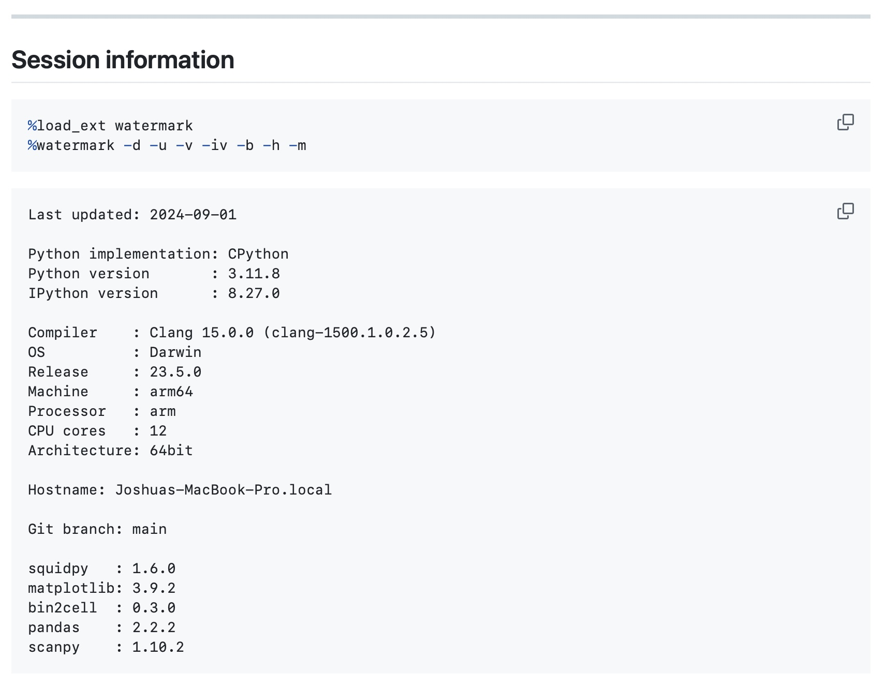

This is a brief write-up to introduce a delightful tool for Jupyter notebooks, ['watermark.'](https://github.com/rasbt/watermark)



Per the project's README, 'watermark' is "An [IPython magic extension](https://ipython.readthedocs.io/en/stable/interactive/magics.html) for printing date and time stamps, version numbers, and hardware information."
You simply add a couple of lines of code to a Jupyter notebook to automatically include key metadata of it's execution.
Below is an example output (from a notebook exported to Markdown and rendered on GitHub):



There are various configuration options for the tool (and it can be used as an imported library in the Python session itself), but I personally decided to just find something that works for me and add it as a snippet in Visual Studio Code:

```json
{
 "notebook watermark": {
  "prefix": "watermark",
  "body": [
   "%load_ext watermark",
   "%watermark -d -u -v -iv -b -h -m",
  ],
  "description": "Standard watermark incantation."
 },
 ...
}
```

'watermark' is a simple, focused tool I use in all my Jupyter notebooks.
I hope you found this quick post useful and have a very merry Christmas!
