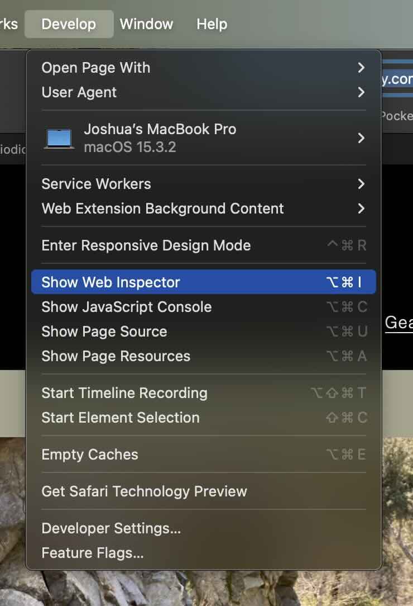
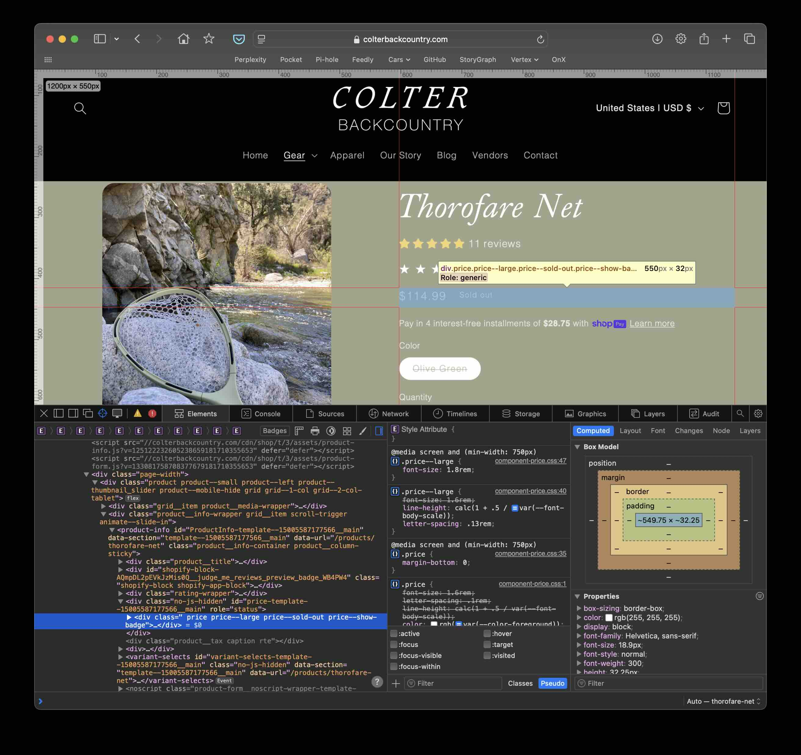
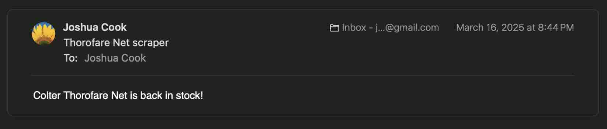

I was introduced to the [Colter Thorofare](https://colterbackcountry.com/products/thorofare-net), a fishing net specifically designed to be light-weight and packable for fishing in remote backcountry locations, in a fly fishing store in Phoenix, AZ, [The Pheasant Tail](https://pheasanttailflyfishing.com).
A few weeks later, after considering other options, I decided to purchase the Thorofare only to find out it was out-of-stock online.
I emailed the designer to express y interest, but otherwise there was no way to get notified when back in stock.
Therefore, I created a simple system to periodically check the stocking the Thorofare and email me when it was back in-stock.

Below, I break down the components of the system: 1) [web scraping](#detecting-the-net-is-out-of-stock), 2) [email notification](#emailing-myself), 3) the [command line interface](#command-line-interface-cli) (CLI), and 4) [chron job GitHub Action](#github-action).
I finished with a few [enhancements](#possible-enhancements) I would consider for the future.

All of the code is available open-source on a Github repo [jhrcook/colter](https://github.com/jhrcook/colter).



## Detecting the net is out-of-stock

The first module of this project to discuss is the web-scrapper, the component responsible for querying the Thorofare webpage and determining the stocking of the product.

To start, I opened the webpage in Web Inspector mode as shown in the image below.
(I'm using Safari, but all common web browsers have a analogous tool.)

From there, I looked for something in the code of the page that I could use as an indiciator for if the net is out-of- or in-stock.
I tried a few options, but found that the `price--sold-out` tag on the price section of the page to be sufficient.

Ideally, I could confirm that this tag is absent in an in-stock item, but at the time of developing this tool, the only other product by Colter was also out-of-stock.
The best I could do instead was to delete this tag in the Inspector pane to show that the page would then render showing the net was in-stock.
It's not perfect, but it was enough for this project.

For the code (full module available [here]((https://github.com/jhrcook/colter/blob/ebc4c087df32e2f2dc927881e1600561495bfdfd/src/colter/scraper.py))[^1]), I started with the main function `is_thorofare_net_soldout()` that just returns `True` or `False` to answer that question.

[^1]: The only other function in the module, `_extract_price_badge_data()`, just contains the code for an earlier implementation. It isn't used in the program, simply there to hold code for future reference.



The `is_thorofare_net_soldout()` function pulls the webpage and ingests it with ['beautifulsoup4'](https://pypi.org/project/beautifulsoup4/).
It then finds the HTML section with the tag `price` and returns whether any attribute of the section contains the string `sold-out`.
I intentionally built in this flexibility to avoid false negatives (*i.e.*, indicating sold-out when actually in-stock) because I would rather erroneously recieve a notification that the Thorofare is in-stock than miss the actually restocking.

## Emailing myself

The [email module](https://github.com/jhrcook/colter/blob/ebc4c087df32e2f2dc927881e1600561495bfdfd/src/colter/email.py) is very simple as it predominately relied on the ['yagmail'](https://pypi.org/project/yagmail/) package.
The only part I had to take care of was creating an API key for my gmail address and providing it as a secret in the environment variable `EMAIL_PASSWORD`.



## Command line interface (CLI)

The CLI was responsible for creating an entrypoint to the package so I could execute the module above in a GitHub Action.
As usual, I used ['typer'](https://pypi.org/project/typer/) as it is still the easiest CLI tool in the Python ecosystem.
There was a single function that just checks if the net is in-stock with `scraper.is_thorofare_net_soldout()` and, if `False` (*i.e.*, is not sold-out), sends an email with `email.send_email()`.



## GitHub Action

The last component of this system was to get this program executed periodically.
For this I used a GitHub Action to execute as a cron job every 2 hours.
The full GitHub Action [YAML](https://github.com/jhrcook/colter/blob/ebc4c087df32e2f2dc927881e1600561495bfdfd/.github/workflows/actions.yaml) is below and fairly straightforward.



Using ['uv'](https://docs.astral.sh/uv/) for Python and dependency management, paired with caching, makes the execution of this Action take a few seconds, typically 12-16 seconds (as you can see [here](https://github.com/jhrcook/colter/actions)).

## Conclusion

Just as I was preparing for bed on the evening of March 16, I received an email from myself with a simple message:

As this was such a niche product, I assumed there wasn't much competition, but figured I might as well buy the net now.
And I'm glad I did because I never received another email, indicating that this latest stock was sold-out within 2 hours.

I have since received my Thorofare and disabled the Github Action workflow.
It's a great product and I enjoy supporting unique products like this built as passion projects by the owner.
I look forward to seeing how Colter choses to further innovate on the design, hopefully using lighter materials and structural designs.

---

## Possible enhancements

Below are some ideas I had for improving this project, but see no need to implement at the moment.

### ChatGPT to detect stocking

After having a running project, I was curious if I could just ask ChatGPT to check the stocking status of the net.
The prompt I used was something to the effect of:

> The following URL is to the webpage for a fishing net called the Thorofare: https://colterbackcountry.com/products/thorofare-net. Please check if it is in-stock, replying with "True" if it is, otherwise "False".

In my simple testing, including pointing to other websites with in- and out-of-stock items, this worked.
Unfortunately, implementing it as an automated process without spending money was non-trivial.
While it is very flexible and simple, since I had a working program, I decided to move on, but this represents a good option for generalizing this kind of service.

### Generalization to other products

Speaking of generalizability, this project is highly specific to a single product.
I could imagine this being more broadly useful in which case I would want a system to make it work for any product.
At the moment, I would picture this working as a protocol oriented system where each item I'm interested in monitoring would have its own class that adheres to a protocol to provide an systematic API for checking the status of the product.
At runtime, all of these items would be checked sequentially and an email with any positive results would be sent.
