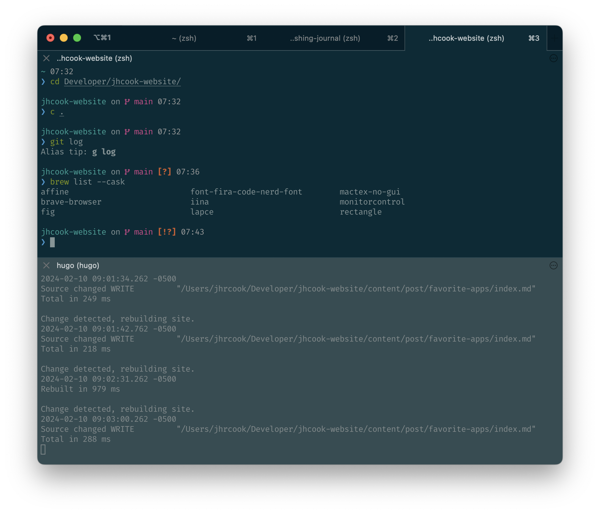
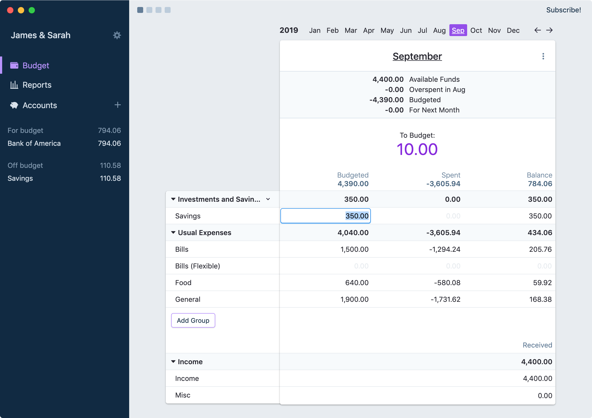

Will do a separate post on command line setup and tools.
VSCode is in the list and I'll do a separate post on the extensions I have installed.

For each application, I have indicated the price with one of the following icons[^2] – <i class="fa-solid fa-hand-holding-heart" title="Free"></i>, <i class="fa-solid fa-hand-holding-dollar" title="Free (with an optional Premium tier)"></i>, <i class="fa-solid fa-dollar-sign" title="Paid"></i> – indicating "free," "free (with a premium tier)," and "paid," respectively.
Additionally, I have noted if the application was installed[^1] from the developer's website, with [homebrew](https://brew.sh), or from the Mac App Store with one of the following icons: <i class="fa-solid fa-globe" title="Installed from developer's website"></i>, <i class="fa-solid fa-beer-mug-empty" title="Installed with Homebrew"></i>, <i class="fa-brands fa-apple" title="Installed from the Mac App Store"></i>.

[^1]: This is how I chose to install the app, but might not be the only option.
[^2]: For each of these icons, the meaning can also be seen by hovering on it with your mouse.

<!-- 
Price: 305C7D
Download: 305C7D

<i class="fa-solid fa-hand-holding-heart" title="Free" style="color:#305C7D"></i>
<i class="fa-solid fa-hand-holding-dollar" title="Free (with an optional Premium tier)" style="color:#305C7D"></i>
<i class="fa-solid fa-dollar-sign" title="Paid" style="color:#305C7D"></i>

<i class="fa-solid fa-globe" title="Installed from developer's website" style="color:#305C7D"></i>
<i class="fa-solid fa-beer-mug-empty" title="Installed with Homebrew" style="color:#305C7D"></i>
<i class="fa-brands fa-apple" title="Installed from the Mac App Store" style="color:#305C7D"></i> 
-->

## Productivity

### [Alfred](https://www.alfredapp.com)

<i class="fa-solid fa-hand-holding-dollar" title="Free (with an optional Premium tier)" style="color:#305C7D"></i>
<i class="fa-solid fa-globe" title="Installed from developer's website" style="color:#305C7D"></i>

</img>

### [AFFiNE](https://affine.pro)

<i class="fa-solid fa-hand-holding-dollar" title="Free (with an optional Premium tier)" style="color:#305C7D"></i>
<i class="fa-solid fa-beer-mug-empty" title="Installed with Homebrew" style="color:#305C7D"></i>

</img>

## Utilities

### [Rectangle](https://rectangleapp.com)

<i class="fa-solid fa-hand-holding-heart" title="Free" style="color:#305C7D"></i>
<i class="fa-solid fa-beer-mug-empty" title="Installed with Homebrew" style="color:#305C7D"></i>

</img>

...

### [Brave](https://brave.com)

<i class="fa-solid fa-hand-holding-heart" title="Free" style="color:#305C7D"></i>
<i class="fa-solid fa-beer-mug-empty" title="Installed with Homebrew" style="color:#305C7D"></i>

</img>

when not on my PiHole instance

## Software Development

### [Visual Studio Code](https://code.visualstudio.com)

<i class="fa-solid fa-hand-holding-heart" title="Free" style="color:#305C7D"></i>
<i class="fa-solid fa-globe" title="Installed from developer's website" style="color:#305C7D"></i>

</img>

will have a post on my top extensions

### [iTerm](https://iterm2.com)

<i class="fa-solid fa-hand-holding-heart" title="Free" style="color:#305C7D"></i>
<i class="fa-solid fa-globe" title="Installed from developer's website" style="color:#305C7D"></i>

</img>
...

## Personal

### [Actual](https://actualbudget.com)

<i class="fa-solid fa-hand-holding-dollar" title="Free (with an optional Premium tier)" style="color:#305C7D"></i>
<i class="fa-solid fa-globe" title="Installed from developer's website" style="color:#305C7D"></i>

</img>

...

### [Pixelmator Pro](https://www.pixelmator.com/pro/)

<i class="fa-solid fa-dollar-sign" title="Paid" style="color:#305C7D"></i>
<i class="fa-brands fa-apple" title="Installed from the Mac App Store" style="color:#305C7D"></i>

</img>

...

### [Day One](https://dayoneapp.com)

<i class="fa-solid fa-hand-holding-dollar" title="Free (with an optional Premium tier)" style="color:#305C7D"></i>
<i class="fa-brands fa-apple" title="Installed from the Mac App Store" style="color:#305C7D"></i>

</img>

...
