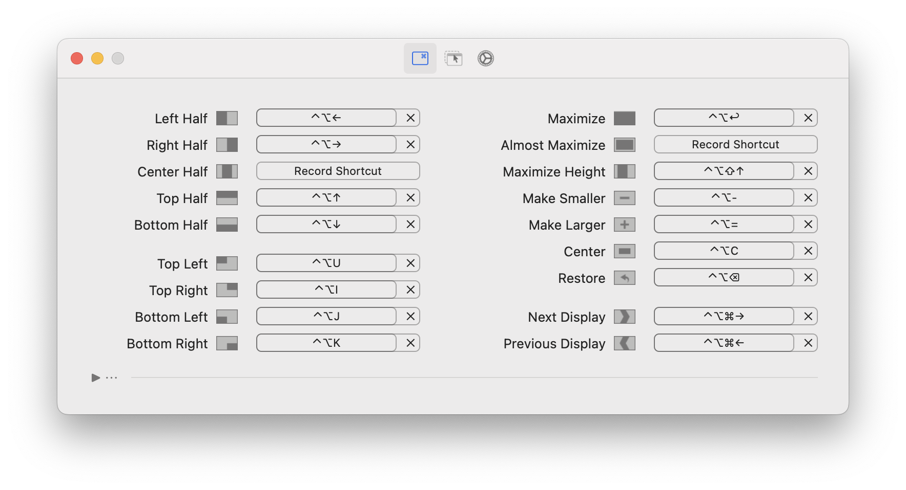
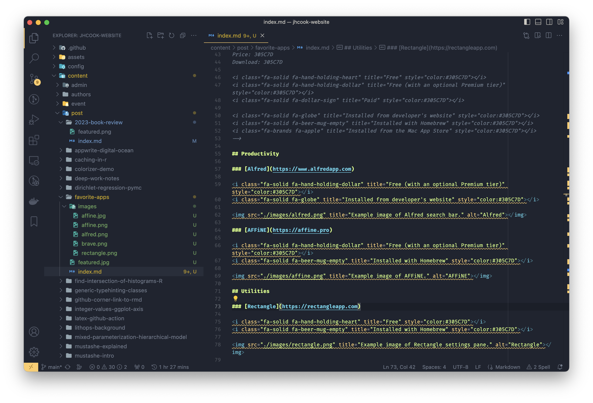
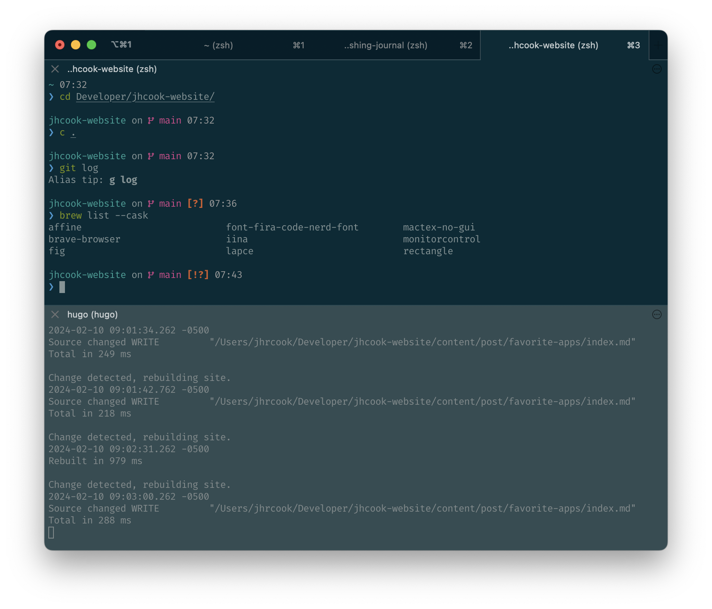
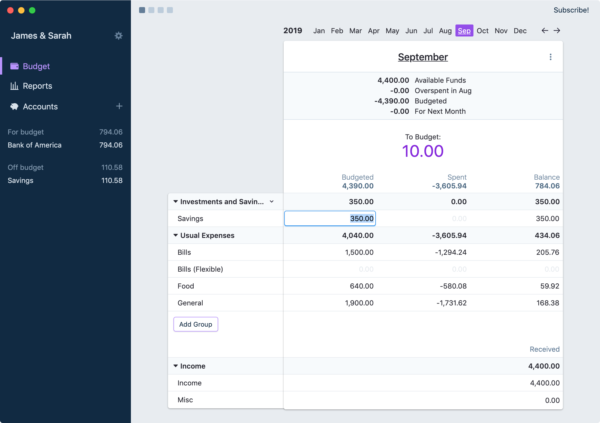
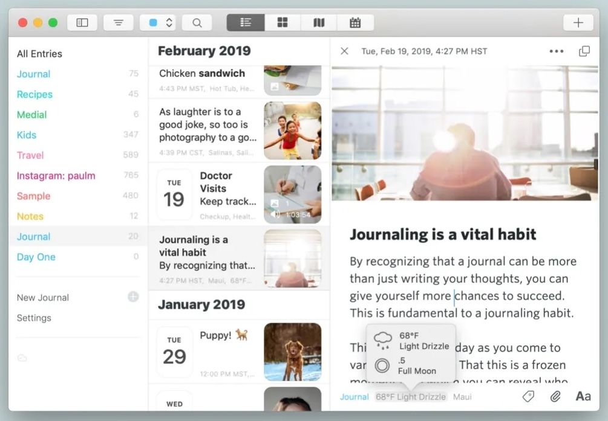

Will do a separate post on command line setup and tools.
VSCode is in the list and I'll do a separate post on the extensions I have installed.

For each application, I have indicated the price with one of the following icons[^2] – <i class="fa-solid fa-hand-holding-heart" title="Free"></i>, <i class="fa-solid fa-hand-holding-dollar" title="Free (with an optional Premium tier)"></i>, <i class="fa-solid fa-dollar-sign" title="Paid"></i> – indicating "free," "free (with a premium tier)," and "paid," respectively.
Additionally, I have noted if the application was installed[^1] from the developer's website, with [homebrew](https://brew.sh), or from the Mac App Store with one of the following icons: <i class="fa-solid fa-globe" title="Installed from developer's website"></i>, <i class="fa-solid fa-beer-mug-empty" title="Installed with Homebrew"></i>, <i class="fa-brands fa-apple" title="Installed from the Mac App Store"></i>.

[^1]: This is how I chose to install the app, but might not be the only option.
[^2]: For each of these icons, the meaning can also be seen by hovering on it with your mouse.

<!-- 
Price: 305C7D
Download: 305C7D

<i class="fa-solid fa-hand-holding-heart" title="Free" style="color:#305C7D"></i>
<i class="fa-solid fa-hand-holding-dollar" title="Free (with an optional Premium tier)" style="color:#305C7D"></i>
<i class="fa-solid fa-dollar-sign" title="Paid" style="color:#305C7D"></i>

<i class="fa-solid fa-globe" title="Installed from developer's website" style="color:#305C7D"></i>
<i class="fa-solid fa-beer-mug-empty" title="Installed with Homebrew" style="color:#305C7D"></i>
<i class="fa-brands fa-apple" title="Installed from the Mac App Store" style="color:#305C7D"></i> 
-->

## Productivity

### [Alfred](https://www.alfredapp.com)

<i class="fa-solid fa-hand-holding-dollar" title="Free (with an optional Premium tier)" style="color:#305C7D"></i>
<i class="fa-solid fa-globe" title="Installed from developer's website" style="color:#305C7D"></i>

</img>

The Alfred application is a replacement for the built-in Spotlight Mac app.
It does everything that Spotlight does and more.
An additional "Powerpack" is available to add integrations, but my most used features are the simplest: quick math and spell-checking.
The latter, in particular, is great at guessing what word I'm trying to type[^3].

[^3]: For example, I used it while writing the following sentence to find the spelling of "gimmicky" from "gimicy".

### [AFFiNE](https://affine.pro)

<i class="fa-solid fa-hand-holding-dollar" title="Free (with an optional Premium tier)" style="color:#305C7D"></i>
<i class="fa-solid fa-beer-mug-empty" title="Installed with Homebrew" style="color:#305C7D"></i>

</img>

AFFiNE is similar to the very popular [Notion](https://www.notion.so) app, except you can self-host it for free.
It does not have all of the features that Notion has and takes more effort to host in the cloud.
I run it locally to organize my various hobbies and more complicated projects.
While it can be useful to have Notion available everywhere, the self-hosting actually allows me to use AFFiNE at work since I run it locally.
I'm still getting used to using the app and how it works and is organized, but I'm starting to build more complicated pages.
I've even built pages with the seemingly-gimmicky abstract drawing interface.

## Utilities

### [Rectangle](https://rectangleapp.com)

<i class="fa-solid fa-hand-holding-heart" title="Free" style="color:#305C7D"></i>
<i class="fa-solid fa-beer-mug-empty" title="Installed with Homebrew" style="color:#305C7D"></i>

</img>

Rectangle provides keyboard shortcuts for organizing windows sizes and positions.
Since it's free, it's hard to find a reason to use any of the other options available on the App Store.

### [Brave](https://brave.com)

<i class="fa-solid fa-hand-holding-heart" title="Free" style="color:#305C7D"></i>
<i class="fa-solid fa-beer-mug-empty" title="Installed with Homebrew" style="color:#305C7D"></i>

</img>

Brave is a replacement internet browser for Chrome.
It does a whole bunch of things I don't care about, namely some random cryptocurrency stuff, but it also blocks a lot of creepy trackers that makes the web nicer to use and safer.
I have [Pi-hole](https://pi-hole.net) running on a [Raspberry Pi](https://www.raspberrypi.com) as my DNS at home, but when I'm away, I use brave to give me some of the protection and ad/tracker blocking.

## Software Development

### [Visual Studio Code](https://code.visualstudio.com)

<i class="fa-solid fa-hand-holding-heart" title="Free" style="color:#305C7D"></i>
<i class="fa-solid fa-globe" title="Installed from developer's website" style="color:#305C7D"></i>

</img>

For the developers out there, this integrated development environment (IDE) needs little discussion.
It's free (if you count supporting Microsoft at the expense of other companies like [JetBrains](https://www.jetbrains.com) "free") and has tons of great extensions (which I'll have a follow up post on).
It takes some getting used to, but once integrated, it's hard to move to any other IDE lacking some of the features and extensions.

### [iTerm](https://iterm2.com)

<i class="fa-solid fa-hand-holding-heart" title="Free" style="color:#305C7D"></i>
<i class="fa-solid fa-globe" title="Installed from developer's website" style="color:#305C7D"></i>

</img>

This is the best terminal for the Mac.
There are a lot of useful features over the built-in Terminal application namely, tabs and split windows, a secure password manager, visual customization, [tmux](https://github.com/tmux/tmux/wiki) support, profiles, and much, much more.
If you are developer and use a Mac, I highly recommend switching over to iTerm and slowly starting using the more advanced features that assist your workflow.

## Personal

### [Actual](https://actualbudget.com)

<i class="fa-solid fa-hand-holding-dollar" title="Free (with an optional Premium tier)" style="color:#305C7D"></i>
<i class="fa-solid fa-globe" title="Installed from developer's website" style="color:#305C7D"></i>

</img>

There are many budgeting apps out there, but I found Actual conforms well to what I want and how I think about budgeting.
It isn't too complicated, works well, and more useful features are being added monthly, so I recommend giving it a shot.
The only thing I had to get used to, coming from just using a spreadsheet to track expenses, was how under- or over-spending in a category can carry over to the next month.
But once I understood how it worked, I found it makes complete sense for some of the categories and now see it as an important feature of budgeting across months.

### [Pixelmator Pro](https://www.pixelmator.com/pro/)

<i class="fa-solid fa-dollar-sign" title="Paid" style="color:#305C7D"></i>
<i class="fa-brands fa-apple" title="Installed from the Mac App Store" style="color:#305C7D"></i>

</img>

This is the only app on this list I paid for and it was completely worth it.
Editing photos is fast and smooth, particularly with the M2 Pro running my MacBook Pro.
The ML features work very well including the color correction and repair tool for "erasing" unwanted parts of the image.
It works as a standalone app and an extension in Photos, so really easy to integrate into normal photo library management.

### [Day One](https://dayoneapp.com)

<i class="fa-solid fa-hand-holding-dollar" title="Free (with an optional Premium tier)" style="color:#305C7D"></i>
<i class="fa-brands fa-apple" title="Installed from the Mac App Store" style="color:#305C7D"></i>

</img>

This is a good journaling app.
There isn't anything in particular that I love compared to any other application, but it works well and I have no complaints.
When Apple releases their journaling application on the Mac, I'll give it a shot and may switch over.
