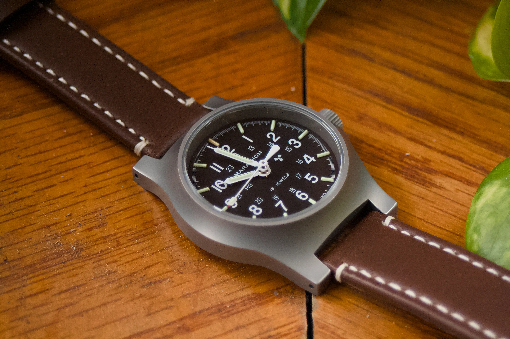
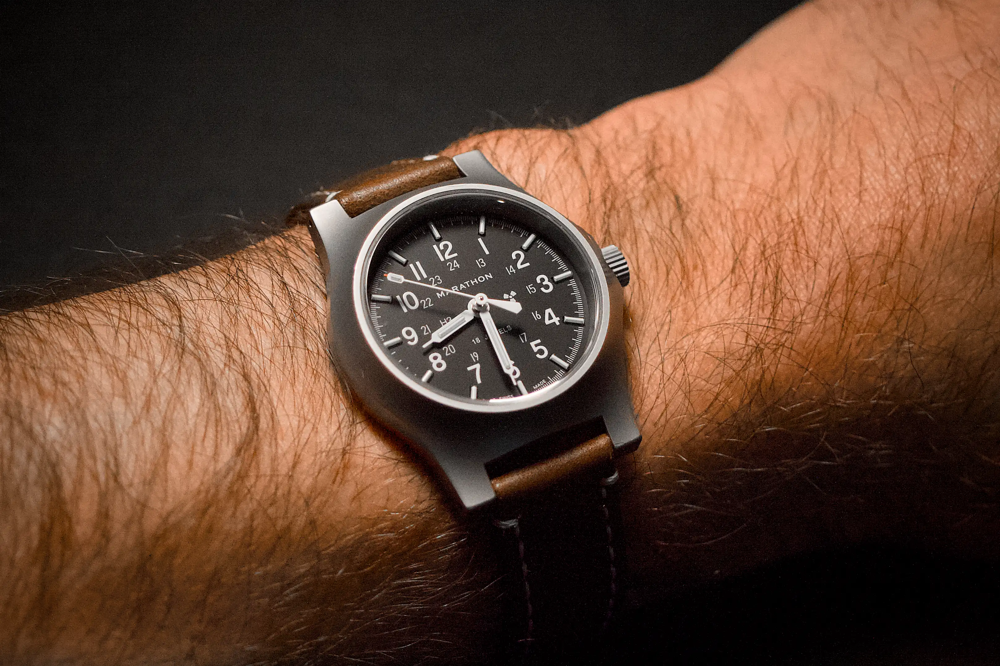
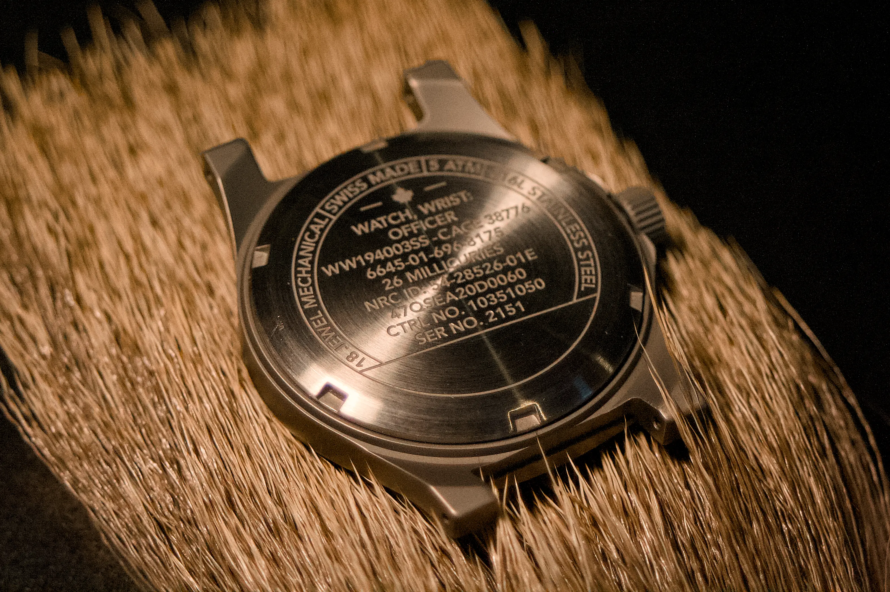
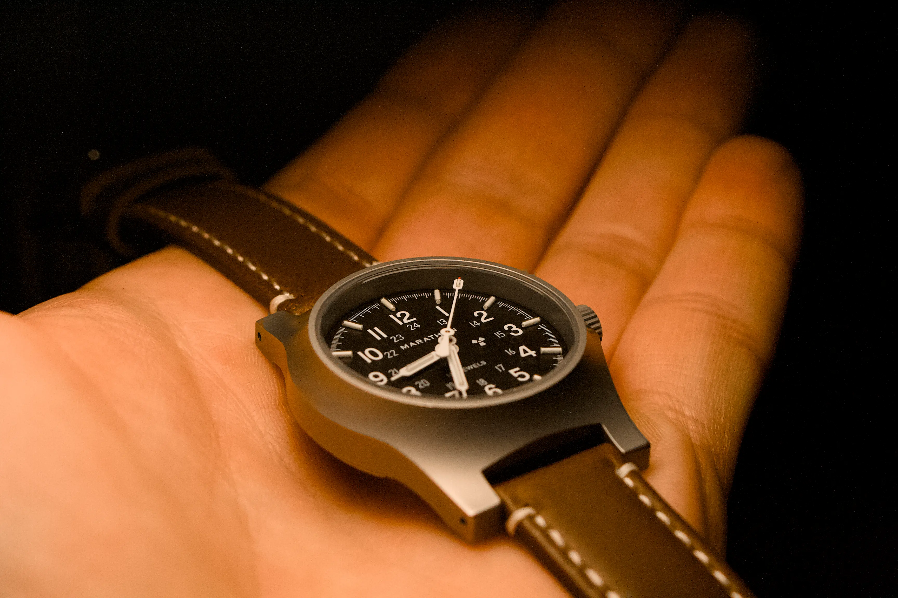
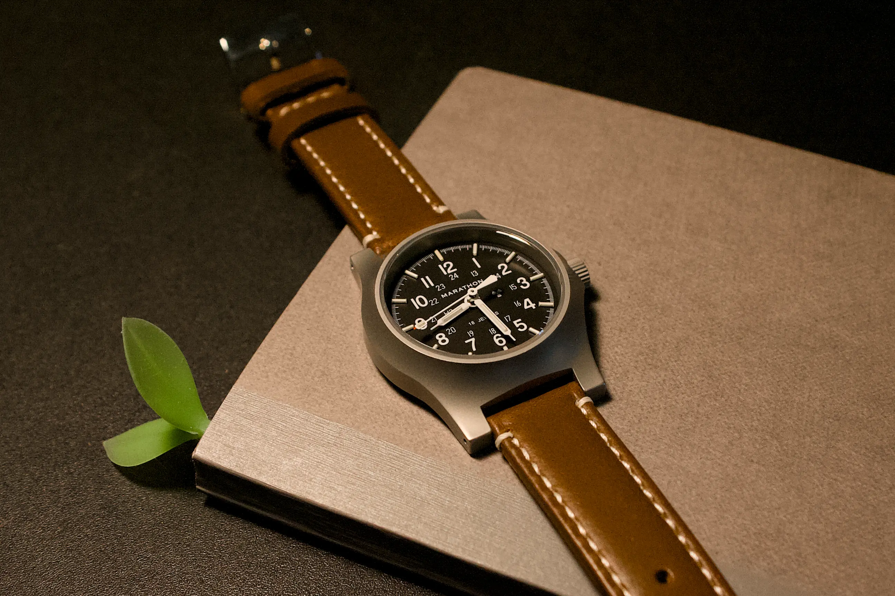

The [Marathon Stainless Steel General Purpose Mechanical (SSGPM) Officer's Mechanical](https://www.marathonwatch.com/products/general-purpose-mechanical-with-tritium-gpm-in-stainless-steel) is an unassuming field watch.
The simple black dial, small 36-mm diameter, and bezel-less designs hides a variety of quirks that make this watch easy and fun to wear.

The specifications are solid.
A small 36-mm diameter, 316L stainless steel case encloses a trustworthy, Swiss-made Swiss-made Sellita SW210-1.
The case is elongated with a lug-to-lug of 44 mm, capped with lugs separated by 16 mm.
The sapphire crystal and screw-down caseback provide 5 atm (50 meters) of water resistance, perhaps a bit light, but nothing unusual for a field watch.

At this point, anyone can reach the conclusion that this fits the bill for a mechanical field watch, and, assuming you're comfortable with the smaller (by today's standards) case diameter, this is fairly standard.

Then the quirks appear.

They stem from Marathon's history of building to-spec military watches, specifically for the General Purpose line, U.S Military Standard [MIL-PRF-46374 G](https://en.wikipedia.org/wiki/MIL-W-46374#G).
This 60's-era origin of this specification explains the smaller diameter.
The requirement for durability also makes the case for a sapphire crystal and [Incabloc® shock absorber](https://en.wikipedia.org/wiki/Incabloc_shock_protection_system).
And sure, the Parkerized finishing reduces the reflectivity of the case[^1].
But what about the radiation?

[^1]: It is not clear to me whether the sapphire crystal has an anti-reflective coating, but my suspicion is it does.

Yes, this watch is intentionally radioactive.
Instead of standard phosphorescent-based luminescence material applied to the dial, Marathon opted for tritium gas tubes glued to each of the three hands and each of the 12 hour indicators.
It is for this reason that the dial has a "H3" (to represent a hydrogen atom with an atomic number of 3[^2]) at the 9-o'clock position and radioactive symbol at the 3.
Perhaps my favorite marking caused by the use of tritium gas tubes is the line on the caseback declaring the radioactivity of 26 millicuries[^3].
As an added bonus, the 12-o'clock tube glows with a different color than the other markers.

[^2]: Tritium has an atomic number of three, one proton (thus the designation at hydrogen) and two neutrons.
[^3]: As a chemist, part of me does wish Marathon would use the SI unit of radioactivity, the [Becquerel](https://en.wikipedia.org/wiki/Becquerel), instead of the [Curie](https://en.wikipedia.org/wiki/Curie_(unit)) (though the latter does see common use). That said, I think replace with "962 MBq" would fail to have the same impact as the well-recognized name of the famous Nobel-winning duo.

And there are other quirks (the perfect term for the fun characteristics of this watch) of the SSGPM that I enjoy.
The case is so simple yet so unusual, a single steel block taking the shape of a volcanic crater, reaching a peak thickness of 11 mm to accommodate the tall tritium-tube laden hand stack.
Even the fact that this watch is manual wind is rather fun, adding to the interaction between wearer and watch.

There are of course some drawbacks to this watch.
The lug width is a short 16 mm.
I have been happy with a Barton leather strap (I got it on sale for around $10 on Amazon, but they normally go for around $30) or a nylon Wocci strap (specifically the woven pattern with a buckle clasp), but it looks great on a NATO of course[^4], but even these are uncommon.
I am considering asking a friend to make me a custom, higher-quality leather strap, but I first want to be sure that leather is the way to go.

[^4]: Though the NATO the cheaper offering from Marathon comes with feels cheap and makes me sad.

Another point of annoyance is the limitation of 5 atm (50 m) of water resistance.
While this is sufficient for daily use (*e.g.*, hand washing, rain, minor splashes), I would have preferred 10 atm (100 m) so I could comfortably take it fishing.

Finally, when I wear my SSGPM, especially at work, I always remember why I prefer to have a date window.

Overall, this watch is simple and fun.
It's a no-fuss field watch with plenty of character that takes a longer glance to appreciate.
Most people will look right over it, but you will be perfectly content knowing that, thanks to Marathons choice in radioactive illumination, your wrist is slowly gaining a super power.
