
 Source


## Introduction

The goal of this project was to be able to automatically identify books in a picture of a bookshelf.
Ideally, this would help me find interesting books at used-bookstores, but was also a fun way to play with image analysis tools.
Below, I share a proof-of-concept that I got working, but I would want to change some of the underlying organization if I were to turn this into a service running on a server.

## Details

### General strategy

Below is the starting image.


Identifying the books will follow the below steps:

1. split the shelves by identifying horizontal lines,
1. tile across the shelf and identify vertical lines,
1. extract the text from each of those vertical slices.

I provide some of the code here, but I don't give a comprehensive review of the workflow.
It's a bit convoluted, and were I to pick this project up again, I would refactor quite a bit.
The source code is available through the link at the top of this page.

### Splitting shelves

The shelves were separated by finding the main horizontal lines in the image.
The function `find_shelf_lines()` shows the series of image analysis steps that I found performs this task well:

```python
import numpy as np
import skimage as ski

from ..models import Line
from .utilities import find_lines

def find_shelf_lines(img: np.ndarray) -> list[Line]:
    """Find the horizontal lines that separate shelves."""
    prepped_img = ski.color.rgb2gray(img)
    prepped_img = ski.exposure.equalize_adapthist(prepped_img)
    prepped_img = ski.filters.sobel_h(prepped_img)
    prepped_img = ski.feature.canny(prepped_img, sigma=1)
    tested_angles = np.linspace(np.pi * 4 / 3, np.pi * 5 / 3, 101, endpoint=True)
    return find_lines(prepped_img, tested_angles, min_dist=100).lines
```

The function `find_shelf_lines()` augments the image of the bookshelf to highlight horizontal lines.
This prepared image is passed to `find_lines()` function, a generalized function for identifying lines, restricting the search to a narrow band of horizontal angles.

```python
def find_lines(
    prepped_img: np.ndarray,
    tested_angles: np.ndarray,
    *,
    min_dist: int,
    min_hspace_threshold: float | None = None,
) -> FoundLines:
    """Find lines in an image.

    Args:
    ----
        prepped_img (np.ndarray): Pre-processed image.
        tested_angles (np.ndarray): Angles to test.
        min_dist (int): Minimum distance between lines in the final collection of best lines.
        min_hspace_threshold (float | None, optional): Minimum threshold for intensity peaks (of `hspace`). The threshold used will be the maximum of this value and `0.5 max(hspace)` (which is the default in 'skimage').

    Returns:
    -------
        list[Line]: List of best lines found.
    """
    hspace, angles, distances = ski.transform.hough_line(
        prepped_img, theta=tested_angles
    )
    hspace_threshold: float | None = None
    if min_hspace_threshold is not None:
        hspace_threshold = max(hspace.max() * 0.5, min_hspace_threshold)

    hspace, angles, distances = ski.transform.hough_line_peaks(
        hspace, angles, distances, min_distance=min_dist, threshold=hspace_threshold
    )
    if hspace.size > 0:
        logger.trace(
            f"hspace avg: {hspace.mean().round(3)}  max: {hspace.max().round(3)}"
        )
    else:
        logger.trace("No lines found.")

    lines = []
    for theta, r in zip(angles, distances, strict=False):
        x, y = r * np.array([np.cos(theta), np.sin(theta)])
        slope = np.tan(theta + np.pi / 2)
        lines.append(Line(point=Point(row=y, col=x), slope=slope))
    return FoundLines(hspace=hspace, angles=angles, distances=distances, lines=lines)
```

I don't have intermediate images of this process, but below are the identified lines.
From here, the image is split and the shelves analyzed individually in the next stage.

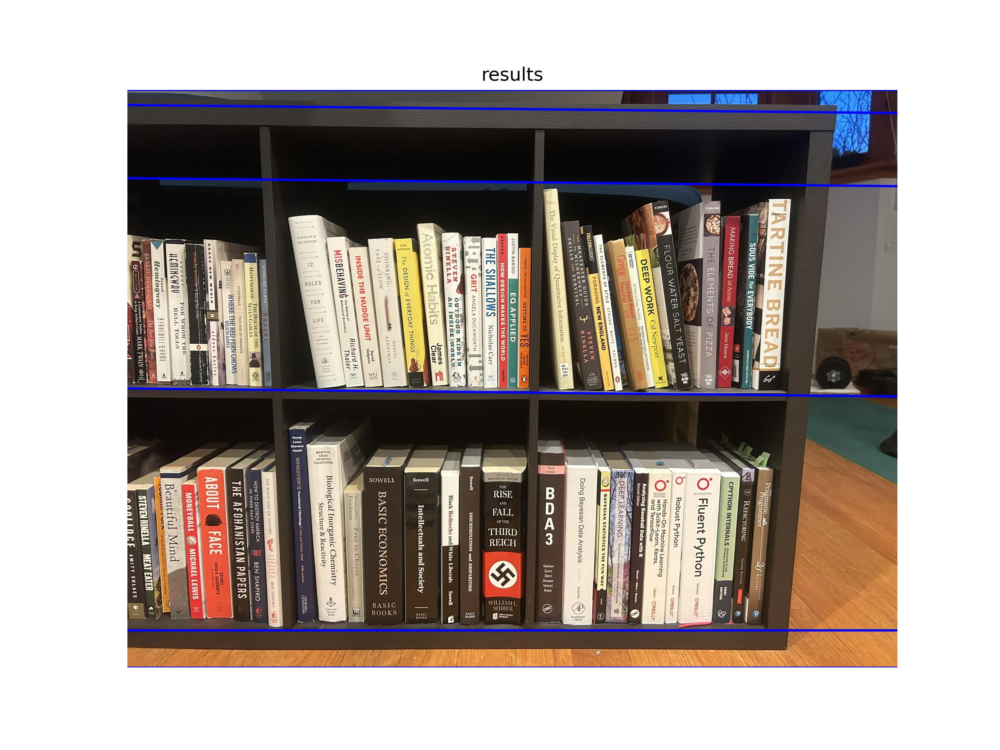


 Below you'll see I have more images of the intermediate steps of the algorithm.
 These proved very useful, emphasizing the value of visualizations.


### Segmenting books vertically

The shelves are next analyzed individually.
I found the process of identifying the vertical lines at the boundaries of the books was improved by working along the shelf in overlapping tiles.
The algorithm for finding the vertical lines for the book boundaries is similar to that for the horizontal lines of the shelves, but the image augmentation steps differ slightly based on empirical results


Were I to revisit this project, I would modularize these image augmentation processes so that multiple algorithms could be run on each image and best results be selected to continue.


The `find_book_lines()` function is provided one of these tiles and returns the identified lines and the intermediate augmented images for visualization.

```python
def find_book_lines(img: np.ndarray) -> tuple[list[Line], list[np.ndarray]]:
    """Find the horizontal lines that separate shelves."""
    gray = ski.color.rgb2gray(img)
    equalized = ski.exposure.equalize_adapthist(gray)
    sobel = ski.filters.sobel_v(equalized)
    canny = ski.feature.canny(sobel, sigma=1.5)
    tested_angles = np.linspace(np.pi * 5 / 6, np.pi * 7 / 6, 101, endpoint=True)
    return find_lines(
        canny,
        tested_angles,
        min_dist=20,
        min_hspace_threshold=200,
    ).lines, [
        gray,
        equalized,
        sobel,
        canny,
    ]
```

Below are the results for the example input image:


    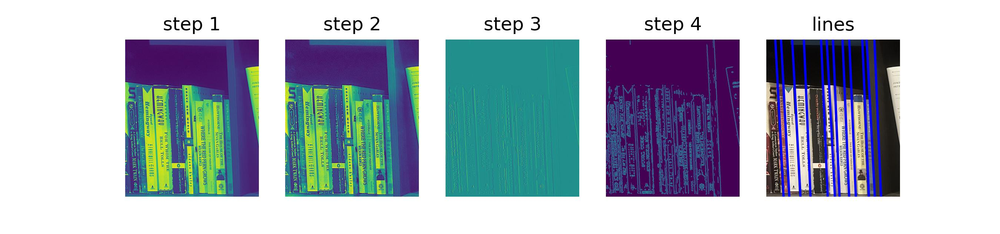
    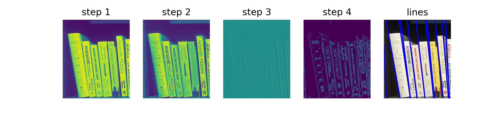
    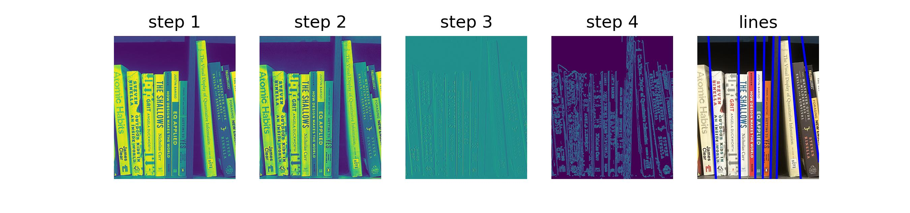
    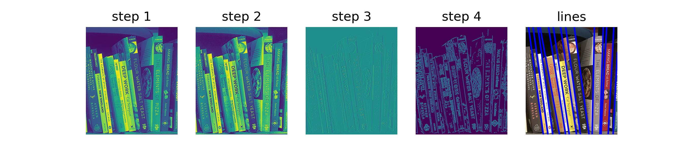
    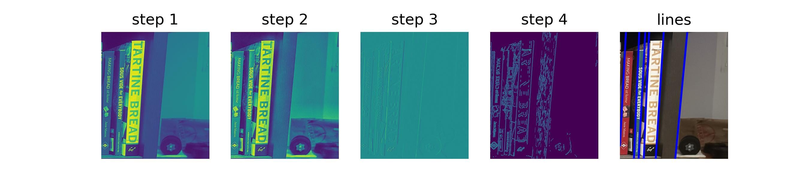
    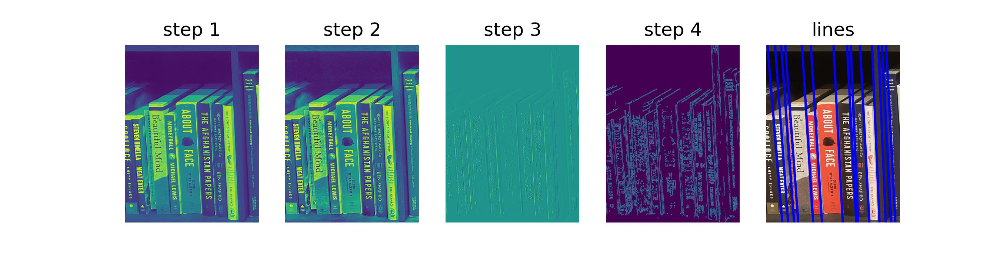
    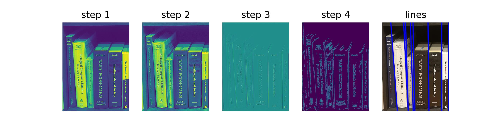
    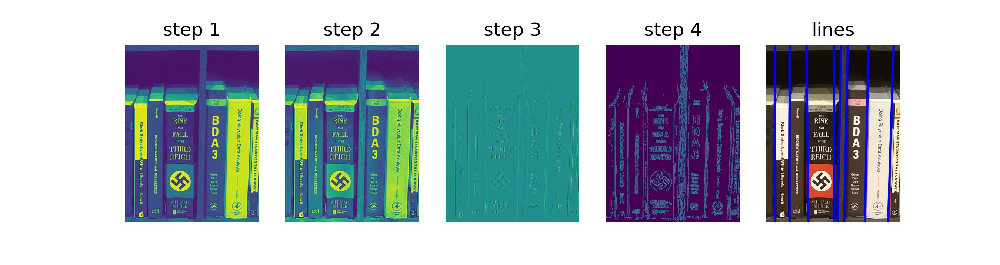
    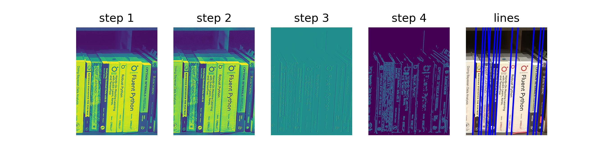
    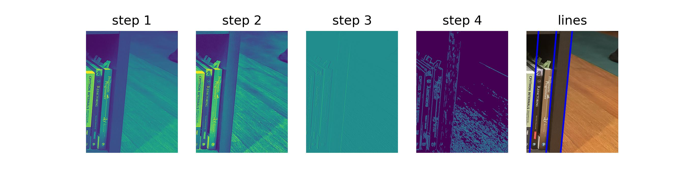


### Text extraction

The text on each book was extracted using [Tesseract](https://github.com/tesseract-ocr/tesseract).
The output quality was highly variable so I ended up executing OCR on the results of two separate image-processing algorithms (included below) at the four possible 90º rotations.
Still, only small fragments were found in most cases.

```python
def _preprocessing_pipeline_1(
    image: np.ndarray,
) -> tuple[np.ndarray, dict[str, np.ndarray]]:
    gray = ski.color.rgb2gray(image)
    exp_eq = ski.exposure.equalize_adapthist(gray)
    gauss = ski.filters.gaussian(exp_eq)
    laplace = ski.filters.laplace(gauss)
    otsu = utilities.filter_otsu(laplace)
    trimmed = utilities.drop_zero_rows_cols(otsu)
    ocr_input = ski.util.img_as_ubyte(otsu)
    intermediates = {
        "original": image,
        "gray": gray,
        "eq. adapt. hist.": exp_eq,
        "Gaussian": gauss,
        "Laplace": laplace,
        "Otsu": otsu,
        "trimmed": trimmed,
        "OCR input": ocr_input,
    }
    return ocr_input, intermediates


def _preprocessing_pipeline_2(
    image: np.ndarray,
) -> tuple[np.ndarray, dict[str, np.ndarray]]:
    gray = ski.color.rgb2gray(image)
    exp_log = ski.exposure.adjust_log(gray)
    exp_eq = ski.exposure.equalize_adapthist(exp_log)
    gauss = ski.filters.gaussian(exp_eq)
    meijering = ski.filters.meijering(gauss, sigmas=(1,), black_ridges=True)
    otsu = utilities.filter_otsu(meijering).astype(float)
    flipped = utilities.flip_background(otsu)
    trimmed = utilities.drop_zero_rows_cols(flipped)
    ocr_input = ski.util.img_as_ubyte(flipped)
    intermediates = {
        "original": image,
        "gray": gray,
        "exp. log": exp_log,
        "eq. adapt. hist.": exp_eq,
        "Gaussian": gauss,
        "meijering": meijering,
        "Otsu": otsu,
        "flipped": flipped,
        "trimmed": trimmed,
        "OCR input": ocr_input,
    }
    return ocr_input, intermediates
```

Since I didn't have perfect text extraction, I was hoping to do some searching of the text against some sort of book database, but I couldn't find a great service for this.
Frustratingly, neither [Goodreads](https://www.goodreads.com) nor [TheStorygraph](https://www.thestorygraph.com) have public APIs for such queries.
As a proof-of-concept, I downloaded my saved books from Goodreads and did some fuzzy matching against the authors and titles with moderate success.
The idea here would be that this tool would identify on the hectic bookshelf authors or books I was looking for already.


It would be valuable to link the OCR-annotation back to the outline of the book in the original image.
Implementing this would require maintaining the provenance of the image slices through the entire process, a feature I would like to include were I to revisit this project.


## Conclusion

The current status of this project is "Archived" because I just don't have time to prioritize it.
Really, it was just meant as an excuse to play with image analysis and learn some new skills.
I may re-visit it in the future and I think I would be able to improve a lot after learning more about he individual steps from this proof-of-concept.
