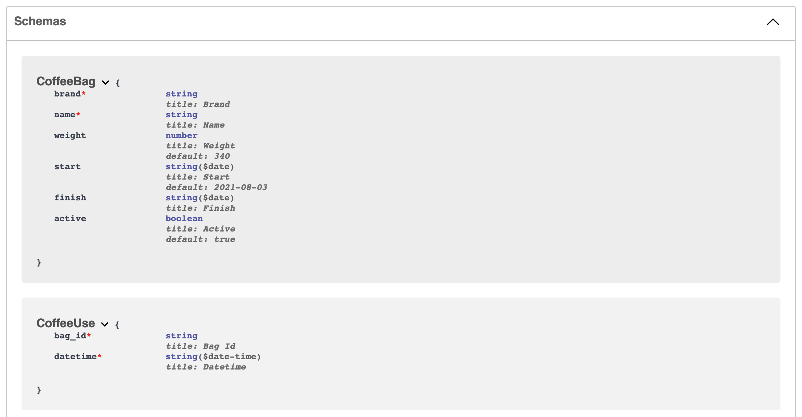
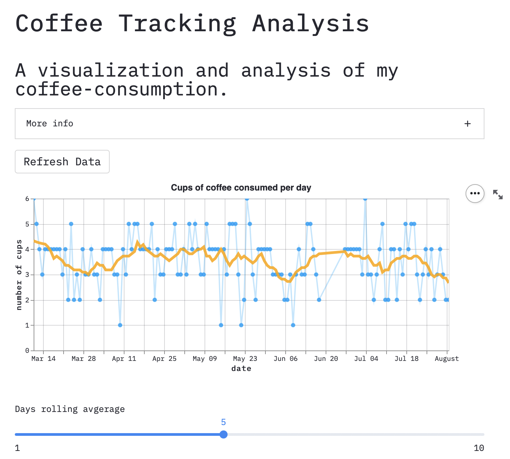
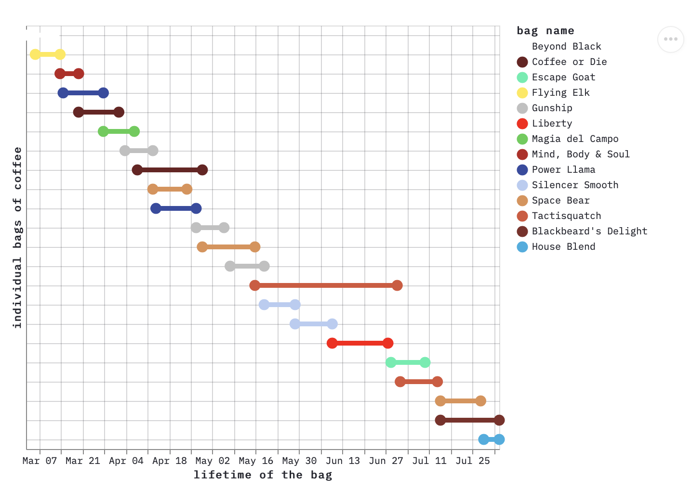

I drink coffee throughout the day and was curious about how much coffee I actually consume.
In addition, I am subscribed to a coffee delivery service and needed to know how to best stagger new deliveries.
Thus, I decided to create a system that tracks my coffee consumption and the lifetimes of the individual coffee bags.

After a bit of deliberation, I designed a system with a central database with a web application programming interface (API) and built several tools for interacting with the API for recording and analyzing data.
Each of the tools in this suite are described below and the source code is available on GitHub.

### Table of Contents

- [Web API](#web-api)
  - [FastAPI application](#fastapi-application)
  - [Deployment](#deployment)
- [Interfaces](#interfaces)
  - [SwiftBar plugin](#swiftbar-plugin)
  - [Streamlit web application](#streamlit-web-application)

---

## Web API


   Source

&ensp;

   Doc


### FastAPI application

I built the web API with [FastAPI](https://fastapi.tiangolo.com).
I have zero prior experience with designing and creating APIs, so I chose FastAPI because it was highly recommended by so many knowledgeable folks in the Python community.
For me, the killer features are the speed of development, built-in type safety and conversion, and automatically-generated documentation.
In the end, I am happy with my choice, and, in practice, my API has been very fast and reliable.

The program uses two primary data models:

1. `CoffeeBag`: an individual bag of coffee
2. `CoffeeUse`: a cup of coffee

Each `CoffeeUse` is paired with a `CoffeeBag` through its `bag_id` attribute.
Each bag of coffee has a name, brand, uniquely-identifiable key, start and finish date, weight of coffee, and an field indicating if the bag is "active" (i.e. open and still in use).
The `CoffeeUse` model is much simpler with just a unique key, the ID of the bag it is associated with, and its date and time of creation.

The features of the API are rather simple – each is generally handled by the single function that acts as an API endpoint.
I tried to build as many interactions with the database as I could think of, constraining the options to those that could be safely and reliably executed.
To that end, there are simple "getters" that retrieve all coffee bag information, just the active coffee bags, the uses of a single coffee bag, all coffee uses, etc.

Then there are the "put" and "patch" endpoints for adding new data or modifying existing data.
These endpoints included functions for adding new bags of coffee or uses of a coffee, and activating/deactivating coffee bags or updating coffee bag information.

Finally, there are the "delete" endpoints for removing various types of information from the database.

### Deployment

The API is deployed by [Deta](https://www.deta.sh) as a ["Micro"](https://docs.deta.sh/docs/micros/about) and uses their ["Deta Base"](https://docs.deta.sh/docs/base/about) database backend.
For a beginner with a small application, this system has been perfect.
It is completely free for the level of traffic that I put through the app.
In addition, there is a helpful [tutorial](https://fastapi.tiangolo.com/deployment/deta/) in the FastAPI documentation for deploying a FastAPI application on Deta.
The Deta Base system is fairly simple; I'm sure underpowered for experienced users, but for a beginner, its constraints are very helpful when navigating the oft overwhelming world of databases.
Only simple interactions are allowed, inherently reducing the complexity of using a database for a beginner such as myself.
In the end, I would still deploy with Deta if I was starting over because it is free and simple to use, making it perfect for a hobby-project such as this.

---

## Interfaces

I needed to create various methods for quickly recording data.
I needed methods that were both easily accessible and quick to use to make sure I could input data immediately, reducing the likelihood I would make a mistake.
To this end, I have generally relied upon a custom SwiftBar plugin for recording data from my computer and will be creating an iOS app so I can use my phone, too.
Also, I wanted a web portal through which I could visualize the data, so I used Streamlit to quickly develop an interactive and good-looking web app.

### SwiftBar plugin


   Source


To make recording each cup of coffee as simple as possible, I wrote a [SwiftBar](https://github.com/swiftbar/SwiftBar) plugin to add an app to my MacBook's menu bar.
Briefly, SwiftBar is a macOS application that enables a programmer to easily add custom menu bar apps just by writing a script that can be run on the command line.
By following a few simple rules, it is easy to add interactive buttons and indicators in a dropdown menu to a highly-accessible location on the computer.
My plugin is a brown drop of coffee[^1] in the menu bar.

[^1]: A wonderful feature of SwiftBar is that Apple's custom [SF Symbols](https://developer.apple.com/sf-symbols/) can be used as icons.

I chose to write my plugin in Python because it is a great scripting language.
Below is a list of features I have included:

- Record a cup of a specific coffee bag at the click of a button
- Report that a bag is complete
- Present the number of cups consumed thus far today
- Add a new coffee bag
- Links to the API docs and Streamlit app (below)

The script itself is a normal Python CLI program except that I chose to use ['Typer'](https://typer.tiangolo.com) to handle the argument parsing because it provides an easy way to add subcommands and automatic type conversion.
The only tricky part was to get 'Typer' to run a specific function as default when no subcommands are provided as input (this behavior is not natively supported by 'Typer').
By using 'Typer', I could have the buttons in the plugin call different subcommands of the same script, thus keeping all of the components of the plugin in a single (albeit long) script.
For example, the dropdown menu provides a list of the active (i.e. available) coffee bags that I can click when I have had a cup of that coffee.
Doing so causes SwiftBar to call the same script that defines the plugin with the subcommand `put-coffee-use` to run a different function in the script.
It is a similar story for finishing or adding a new bag of coffee.

</img>

A few minor features I have added over time include making the menu bar icon clear when there is no network connection or into a red triangle with a drop in the middle if there are no coffee bags available.
Also, if a HTTP request to the API fails, then I get a notification through the standard macOS notification system to let me know something went wrong.
At the moment, I am waiting for the next release of SwiftBar which is expected to have plugin-specific caching and data storage capabilities.
This will allow me to cache data if there is no network connection and retry sending information when reconnected to the internet.

### Streamlit web application


   Source

&ensp;

   Web App


The purpose of this interactive web application is to have a simple and live visualization of the data I have recorded thus far.
I built it with the [Streamlit](https://streamlit.io) library, a framework for "turning data scripts into shareable web apps in minutes."
This library removes almost all of the normal hassle of creating an application for the web by providing easy-to-use widgets that can be used in a Python script to render data, plots, etc. and accept user input with sliders, buttons, etc.
In the end, creating the app was no different than writing a Python data analysis script, thus I was able to produce this application quickly and with tools I was already familiar with.

I have previously written a blog [post]() on deploying Streamlit applications with Docker and Heroku, but since then, Streamlit has created its own hosting service that I chose to use for this app (more info on that [here](https://docs.streamlit.io/en/stable/deploy_streamlit_app.html)).

For the interactive plots, I originally used ['Bokeh'](https://bokeh.org), but found ['Altair'](https://altair-viz.github.io) more intuitive based on my experience with ['ggplot2'](https://ggplot2.tidyverse.org)[^2] in R.
Below are some screenshots of the app taken on August 3, 2021.
The first shows the daily number of cups of coffee over time and the second is a dumbbell plot of the lifetimes of the coffee bags I have recorded.

[^2]: The 'gg' in 'ggplot' stands for [*Grammar of Graphics*](https://www.springer.com/gp/book/9780387245447), a syntax for constructing graphs from individual components.

---

Cover image source: https://wallup.net/photography-coffee-cup-depth-of-field-coffee-beans

