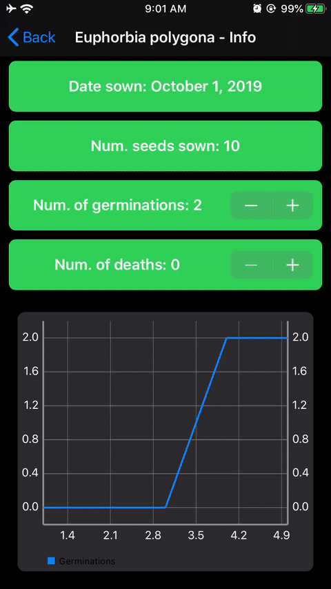


   Source


## Purpose

A hobby I have picked up recently is growing succulents and cacti from seed.
I have sown *Lithops* and one batch of *Astrophytum*, but still have a bunch more seeds ready for another batch.
The goal of this app is to help me track their progress and keep notes on my husbandry.
It records how many seed and when I sowed.
Further, it tracks their germination rate over time and has a handy section where I can record my notes on the process.
Finally, I can visually record their progress in a library of photos.

## Design and Layout

### Information View

Selecting a plant brings in a page containing the general information about the seeds such as when they were sown and how many seeds were included.
There is also a place for input from the user to record when a seed germinations and when a seedling dies.
This data is presented graphically in a chart.

### Notes

Swiping to the right brings in a table with notes from the user about their plants.
Each is dated and presented in chronological order.
Taping on a cell allowed the user to delete or edit the note.

### Gallery

(in development)

This is a collection of photos of the seeds as they grow.
The user can select and view individual photos, or play them back in a slideshow.

## Current Status

This is very much a work in progress, but is coming along great!
I am purposefully restricting the scope of this app so it does not decrease in functionality due to feature creep.
The hope is to eventually submit to the App store (and put betas on Test Flight).
