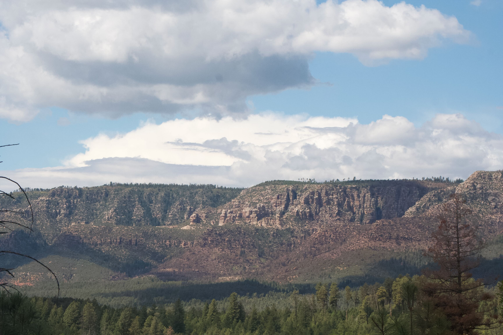
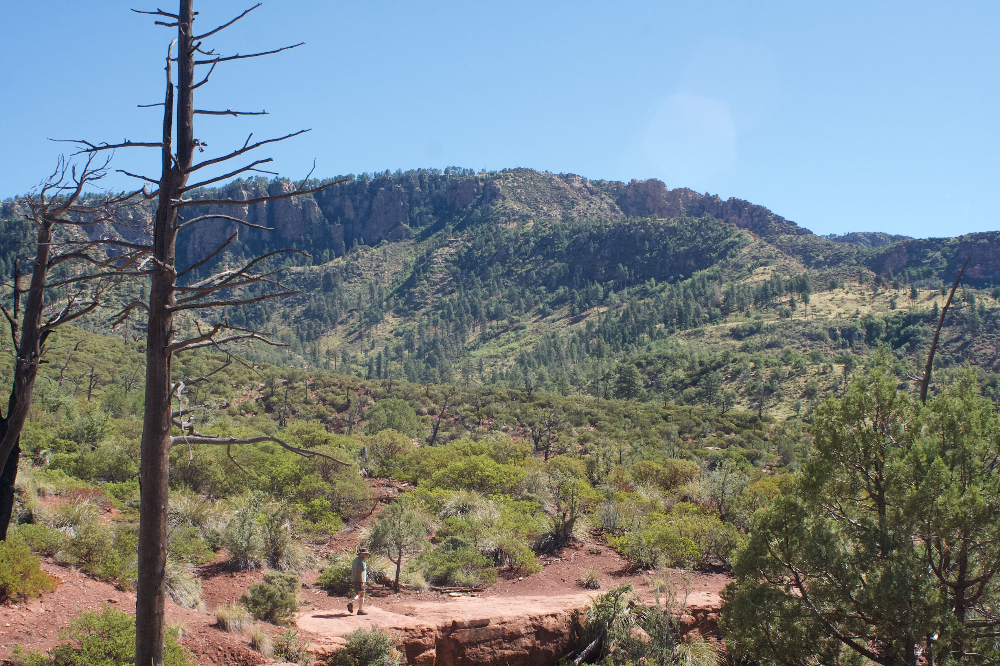
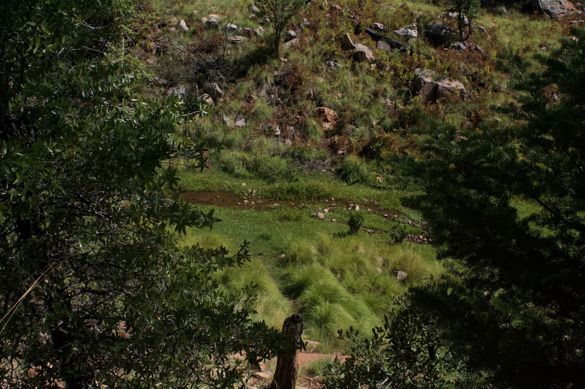
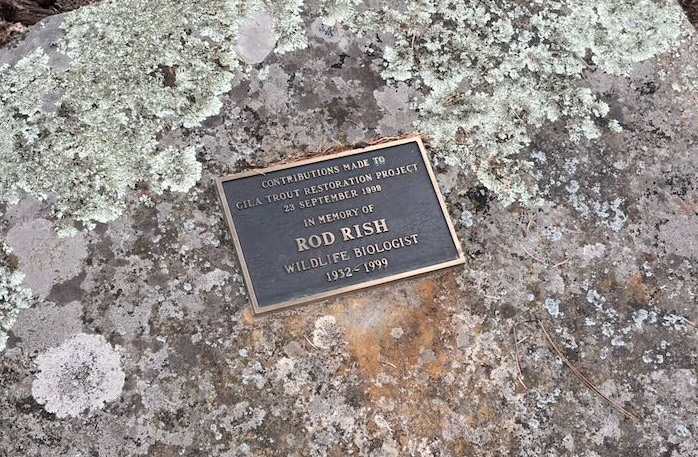
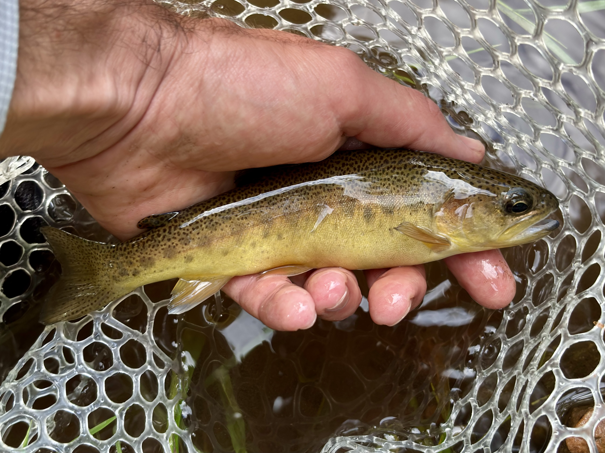

## Background

As described at the [WNTC](https://westernnativetroutchallenge.org) website, "The Western Native Trout Challenge invites anglers to help celebrate our western legacy by catching native trout and char in each of the 12 participating Western states."
As trout and char generally require cold, clear, moving water, seeking these fish takes anglers to some of the most pristine regions of this country.
I look forward to the many adventures that this challenges will take me on over the coming year.

## Species

### Gila Trout

**Sept. 20, 2025 – Payson, AZ**

I began my journey on the WNTC by attempting to catch a [Gila Trout](https://storymaps.arcgis.com/stories/32869c5ae73845128efcd4859cbcd1b8#ref-n-OziEur) in Arizona.
Along with the Apache, this is one of the only two native trout to the state of Arizona.
Many are surprised to learn that Arizona has any native trout in this state famous for its deserts.
In fact, AZ has incredible ecological diversity, including many high-altitude pine forests.

And it's in these forests of Payson, AZ where the Gila Trout can be found.
The remaining streams are few, and there is only one in which truly native Gila can be found.
This is a tremendous achievement of the local conservation groups that have managed to rehabilitate and maintain this region.

Getting to this stream was a bit of a hike.
My Dad was excited to join me on this adventure for my birthday, but it definitely pushed him to his limits.
It took the entire day and we only got to explore the water for an hour or so and catch a small fingerling and a good 6-incher.
I would love to do this again, and make an overnight trip out of it.


  
  
  
  
  


### California Golden Trout

**June 29, 2026 – Golden Trout Wilderness**

My second accomplishment for the WNTC was the [California Golden Trout](https://storymaps.arcgis.com/stories/32869c5ae73845128efcd4859cbcd1b8#ref-n-OJ6dEu), my first of the three species of golden trout.
This was part of an incredible backpacking trip with my good friend, Jacob, through the Golden Trout Wilderness in Inyo National Forest.
The adventure to catch this beautiful fish in the stunning Sierra Nevada scenery is one I will never forget.
I recount the trip in greater detail in the blog post below.


